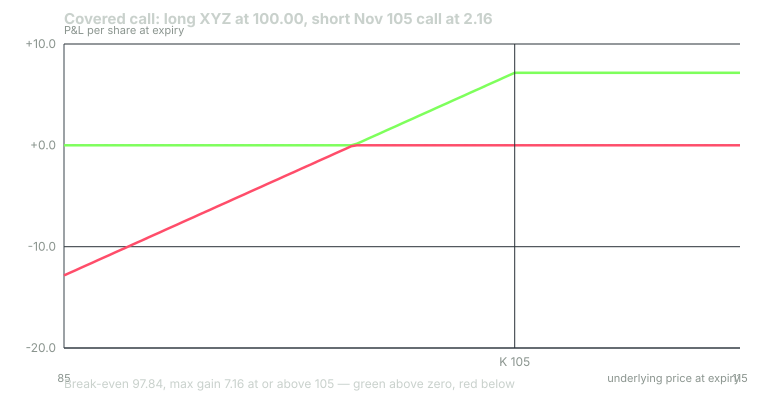

---
{
  "title": "Covered Calls: Strike Selection, Assignment and the BXM Record",
  "duration": "17 min",
  "free": true,
  "status": "published",
  "quiz": [
    {"q": "You buy 100 XYZ at 100.00 and sell the November 105 call at 2.16. What is the if-called return over the 45 days, before commissions?", "opts": ["2.21%", "7.32%", "5.00%", "7.16%"], "correct": 1, "explain": "Net outlay is 100 - 2.16 = 97.84 per share. If called at 105 you receive 105 plus you kept 2.16, a total gain of 7.16. 7.16 / 97.84 = 7.32%."},
    {"q": "Which strike gives the highest static return (premium divided by net outlay) on the chain?", "opts": ["110 call at 1.00", "105 call at 2.16", "95 call at 7.15", "100 call at 4.16"], "correct": 3, "explain": "Static return counts only time value that decays: 100 call 4.16 / 95.84 = 4.34%; 105 call 2.16 / 97.84 = 2.21%; 110 call 1.00 / 99.00 = 1.01%. The 95 call has 5.00 of intrinsic value, so its time value is only 2.15 and its static return on 92.85 is 2.32%."},
    {"q": "Cboe's BXM factsheet (August 31, 2026) shows BXM returned 13.3% in 2013 against 32.4% for the S&P 500. What does that year illustrate?", "opts": ["Covered calls lose money in bull markets", "The cap costs most exactly when the market runs, and the monthly premium cannot keep pace", "The BXM methodology was changed in 2013", "Covered calls underperform because of dividends"], "correct": 1, "explain": "BXM writes an at-the-money call each month, so in a year of steady gains it repeatedly gives up the move above the strike and keeps only the premium; 2013 is the clearest example in the recent record."},
    {"q": "Your short 105 call is in the money at 105.40 the day before an ex-dividend date. Assignment risk is highest when:", "opts": ["The dividend exceeds the call's remaining time value", "The stock is below the strike", "IV rank is above 50", "The call has more than 30 days to expiration"], "correct": 0, "explain": "A holder exercises early to capture a dividend only when the dividend is worth more than the time value they give up by exercising. The model chain has no dividend, so early assignment there is unlikely; real stocks require the check."},
    {"q": "What does a covered call NOT do?", "opts": ["Lower the break-even on the shares by the premium", "Cap the upside at strike plus premium", "Protect the shares against a large decline", "Reduce the position's delta below 1.0"], "correct": 2, "explain": "The premium is a fixed cushion (2.16 on the 105 call). A drop to 90 still loses 10.00 - 2.16 = 7.84 per share; the call does not hedge, it pre-sells the upside."}
  ],
  "task": "Take a stock you own or would own, pull its chain 30 to 60 days out, and compute static and if-called returns for three strikes; write down the probability of being called for each using the call's delta."
}
---

## The position

A covered call is long 100 shares plus a short call on those shares. On the model chain, buy 100 XYZ at 100.00 and sell one November 105 call at the 2.16 mid. Net outlay per share is 100.00 - 2.16 = 97.84, or $9,784 per hundred shares. That 97.84 is your break-even on the stock at expiration, and it is the only downside protection the trade provides.

Above 105 the stock is called away: you deliver shares at 105 and keep the 2.16, so the position is worth 107.16 regardless of how high XYZ goes. Below 105 the call expires worthless, you keep the shares and the premium, and your profit or loss is the stock's move plus 2.16. The Greeks you learned still apply: at entry the 105 call has delta 0.35, so the position's delta is 1.00 - 0.35 = 0.65 shares per hundred, theta is positive (you earn about 0.044 per day at 45 DTE), and vega is negative (a rise in IV marks the short call against you).

You already know from the previous course that a covered call and a short put at the same strike are the same trade by put-call parity. Lesson 3 uses that fact to reconcile the two.

## Strike selection is a choice of what you sell

There are three honest ways to pick the strike, and each is a different claim about the stock.

**At the money** (100 call, 4.16): the largest time value and the largest static return, 4.16 / 95.84 = 4.34% over 45 days. You are saying you expect XYZ to go nowhere and want to be paid for it. Probability of being called, read from the call's delta, about 54%; the model's risk-neutral probability of finishing in the money is 50%. This is the BXM's choice.

**Moderately out of the money** (105 call, 2.16): static return 2.21%, if-called return 7.32%, probability of being called about 31 to 35%. You keep the first 5.00 of appreciation. This is the most common retail choice because it feels like a compromise; it is, and the premium is roughly half the at-the-money amount.

**Far out of the money** (110 call, 1.00): static return 1.01%, if-called return 11.1%, probability of assignment about 17 to 19%. You are selling very little and giving up very little. At this distance the bid/ask (0.96 / 1.04, 8% of the mid) is a larger fraction of what you collect.

The mistake is to pick the strike by the premium alone. The premium is the price of the upside you are selling; the 100 call pays twice the 105 call because it sells twice as much of the distribution. Decide first how much of the stock's upside you are willing to forgo over the next 45 days, then read the price.

## Assignment

If XYZ closes above 105 on November 6 by $0.01 or more, the OCC exercises the long side by exception and you are assigned: your broker removes 100 shares and credits $10,500. Nothing else happens; there is no additional loss, and you have no position on Monday. Early assignment on the model chain is unlikely because XYZ pays no dividend and an early exerciser would forfeit time value. On a dividend-paying stock the check is simple: if the call is in the money and the dividend exceeds the call's remaining time value on the day before ex-date, expect assignment and decide whether to close or roll before the close.

Being called away is not a failure. It is the maximum profit of the trade. Traders who "do not want to lose the shares" should not sell calls; rolling up and out to avoid assignment, which Lesson 9 prices, is usually paying a debit to keep a position you already agreed to sell.

## What the BXM record says

The Cboe S&P 500 BuyWrite Index does this mechanically: it holds the S&P 500 and each third Friday writes the one-month SPX call at the first strike above the index level, held to expiration and cash-settled to the opening settlement value. Its history starts June 20, 1986; the index was launched April 11, 2002, so everything before that date is a back-test under the published methodology.

Whaley (2002) studied June 1988 to December 2001 and found BXM's return close to the S&P 500's with about two-thirds of the volatility. Hewitt EnnisKnupp (2012) extended that to January 31, 2012: BXM and the S&P 500 both compounded at about 9.2% a year, BXM with 11.4% annualised standard deviation against 15.9%, and a monthly return skew of -1.55 against -0.78. Israelov and Nielsen (2014) decomposed the return and showed that most of it is simply the equity exposure the strategy keeps (its beta was 0.62 on the current factsheet), with the short-volatility premium a smaller second component and the strike choice a third.

The Cboe factsheet dated August 31, 2026 tells the rest of the story. From June 20, 1986, BXM's annualised return was 8.6% against 11.2% for the S&P 500 total return index, with volatility of 10.7% against 15.2% and a maximum drawdown of -35.8% against -50.9%. Year by year, BXM kept pace or better when the market was flat or down (2011: 5.7% against 2.1%; 2018: -4.8% against -4.4%; 2022: -11.4% against -18.1%) and lagged badly when it ran (2013: 13.3% against 32.4%; 2020: -2.8% against 18.4%; 2021: 20.5% against 28.7%). Over the 2009 to 2026 bull market the cap cost more than the premium paid, and the 30-year parity that Whaley and Hewitt EnnisKnupp found became a 40-year shortfall.

That is the honest summary of covered calls as a total-return strategy: lower volatility, smaller drawdowns, a lower beta, and a return that depends on the path. In sideways and falling markets the premium is a real contribution; in strong markets it is a fee you pay to feel safer.

## Worked example

Buy 100 XYZ at 100.00, sell one November 105 call at 2.16. All figures per 100 shares, commissions excluded.

Net outlay: (100.00 - 2.16) x 100 = $9,784. Break-even at expiry: 97.84.

Static return (call expires, stock unchanged): 216 / 9,784 = 2.21% for 45 days.

If-called return (XYZ at or above 105): gain = (105 - 100) x 100 + 216 = 500 + 216 = $716. 716 / 9,784 = 7.32% for 45 days. Maximum profit is $716; no price above 105 improves it.

Four closes on November 6, covered call versus 100 shares held unhedged:

- XYZ 90: shares -1,000, call expires, keep 216. Covered call -$784. Unhedged -$1,000.
- XYZ 100: shares 0, keep 216. Covered call +$216. Unhedged $0.
- XYZ 105: shares +500, keep 216. Covered call +$716. Unhedged +$500.
- XYZ 115: shares called at 105, +500, keep 216. Covered call +$716. Unhedged +$1,500. Opportunity cost: $784.

Probability of assignment, from the model: the 105 call's risk-neutral probability of finishing in the money is 31% (delta 0.35 overstates it slightly, as it always does for calls). Roughly one cycle in three ends with the shares called.

Annualising: 45-day cycles repeat 365 / 45 = 8.1 times a year, so 2.21% static becomes 17.9% simple if every cycle expired unchanged. Do not write that number down as expected income. The stock does not sit at 100 for a year; the payoff table above is the truth of one cycle, and the BXM history is the truth of many.

## Chart

The line is the stock's own payoff shifted up by the premium and then flattened at the strike. Everything to the left of 97.84 is the equity risk you still hold.

## Sources

- Cboe Global Indices, BXM index methodology and dashboard: https://www.cboe.com/us/indices/dashboard/bxm/
- Whaley, R. E. (2002), "Return and Risk of CBOE Buy Write Monthly Index", *Journal of Derivatives* 10(2): https://doi.org/10.3905/jod.2002.319194
- Israelov, R. and Nielsen, L. N. (2014), "Covered Call Strategies: One Fact and Eight Myths", *Financial Analysts Journal* 70(6): https://doi.org/10.2469/faj.v70.n6.3
- Hewitt EnnisKnupp (2012), "The CBOE S&P 500 BuyWrite Index (BXM): A Review of Performance", published by Cboe: https://cdn.cboe.com/resources/education/research_publications/HewittEnnisKnupp-BXM-(2012).pdf
