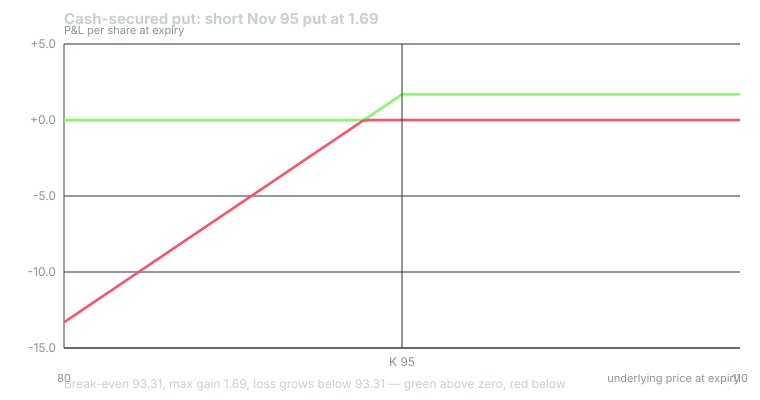

---
{
  "title": "Cash-Secured Puts: The Arithmetic, the Capital, the PUT Index",
  "duration": "16 min",
  "free": false,
  "status": "published",
  "quiz": [
    {"q": "You sell one November 95 put at 1.69 with $9,500 set aside. If assigned, what is your cost basis per share?", "opts": ["95.00", "96.69", "93.31", "100.00"], "correct": 2, "explain": "Assignment buys 100 shares at 95; the premium received reduces basis, per IRS Publication 550, to 95 - 1.69 = 93.31."},
    {"q": "What is the maximum loss on a cash-secured 95 put sold at 1.69, per contract?", "opts": ["$169", "$9,500", "$9,331", "Unlimited"], "correct": 2, "explain": "If XYZ goes to zero you are assigned at 95 and the shares are worthless: 9,500 paid less 169 received = $9,331. It is a large, finite number, and it is the capital the trade puts at risk."},
    {"q": "Under FINRA Rule 4210, the Reg T requirement for the same put sold uncovered is the greater of 20% of the underlying minus the out-of-the-money amount plus premium, or 10% of the strike plus premium. On the chain that is:", "opts": ["$1,669", "$1,119", "$9,500", "$2,000"], "correct": 0, "explain": "20% x 10,000 = 2,000, minus the 500 OTM amount, plus 169 = $1,669; the alternative 10% x 9,500 + 169 = $1,119 is smaller. The requirement is $1,669, about 18% of the cash-secured amount, which is where over-leverage begins."},
    {"q": "Cboe's PUT factsheet (January 3, 2007 to August 31, 2026) shows PUT at 7.1% annualised against 11.0% for the S&P 500, with a -32.7% maximum drawdown against -50.9%. Which conclusion is supported?", "opts": ["Put writing outperformed stocks over the period", "Put writing had lower volatility and a smaller worst drawdown but trailed the index's return over a window dominated by a bull market", "Put writing carries no equity risk", "The PUT index is leveraged"], "correct": 1, "explain": "The factsheet also shows volatility of 10.7% against 15.4% and beta of 0.6. Those are the same trade-offs as the BXM: a smoother, lower-beta path that gives up return when the market runs."},
    {"q": "Why should assignment on a cash-secured put be treated as the intended outcome rather than a failure?", "opts": ["Because assigned shares are always immediately profitable", "Because the broker waives fees on assignment", "Because the trade was a limit order to buy at 93.31 that paid you to wait, so buying at that price is the plan working", "Because you can always roll instead"], "correct": 2, "explain": "A cash-secured put is a paid limit order. If you would not be happy owning 100 shares at 93.31, the strike was wrong, not the assignment."}
  ],
  "task": "For one stock you would be willing to own, choose a put strike at or below a price you would pay, and compute the credit, the cash to set aside, the effective purchase price if assigned, and the return on cash if it expires."
}
---

## The position

A cash-secured put is a short put with the full strike value held in cash. On the model chain: sell one November 95 put at the 1.69 mid and hold $9,500 in the account against it. If XYZ closes below 95 on November 6 you are assigned and buy 100 shares at 95. If it closes above, the put expires and you keep $169.

Everything about the trade follows from treating it as what it is: a limit order to buy 100 shares at 93.31 that pays you $169 to leave it working for 45 days. If you would be glad to own XYZ at 93.31, the trade makes sense whichever way it resolves. If you would not, no amount of premium makes it a good trade, because assignment is the outcome the premium is paying you to accept.

Greeks at entry, from the chain: delta -0.27 (so the position is long 27 shares' worth of XYZ), theta about +0.033 per day, vega negative. Probability of finishing in the money at expiry, from the model: 30%.

## The arithmetic

Three numbers define the trade and you should be able to produce them without a calculator.

**Return on cash if it expires.** 169 / 9,500 = 1.78% over 45 days. The cash also earns interest while it waits; at the chain's 4% rate that is 9,500 x 0.04 x 45/365 = $46.85, so the all-in return on the reserved cash is (169 + 46.85) / 9,500 = 2.27%. The Cboe PUT index is built exactly this way, puts over a Treasury bill account, and its return includes the bill interest. Yours should too, and so should your comparison to buy-and-hold.

**Effective purchase price if assigned.** 95 - 1.69 = 93.31. That is also your tax basis (Lesson 11). Relative to today's 100.00 it is a 6.7% discount, and relative to the one-sigma 45-day move of 9.83 it is 0.68 standard deviations down.

**Maximum loss.** 9,331 per contract, if XYZ goes to zero. It will not, usually, but the number is the point: this trade risks the price of a hundred shares, not the premium. The premium is 1.8% of what is at stake.

## The true capital at risk

Brokers do not require you to hold $9,500 against a short put. Under FINRA Rule 4210 the Reg T requirement for an uncovered equity put is the greater of (a) 20% of the underlying value minus the out-of-the-money amount plus the premium, or (b) 10% of the strike plus the premium. On the chain: (a) 0.20 x 10,000 - 500 + 169 = $1,669; (b) 0.10 x 9,500 + 169 = $1,119. The requirement is $1,669.

That is where cash-secured put selling turns into something else. An account with $9,500 can sell one put cash-secured or, on Reg T, five and a bit. The premium collected goes from $169 to $845; the maximum loss goes from $9,331 to $46,655 on an account that holds $9,500. The requirement also rises as the stock falls, because the out-of-the-money deduction shrinks and the premium grows, so the margin call arrives at the worst moment. Lesson 10 works through the sizing; for now, the rule is that the capital at risk on a short put is the strike, whatever the broker asks you to post.

## Covered call and cash-secured put, reconciled

Put-call parity says a short put at K plus cash equals long stock plus a short call at K. Check it on the chain at the 95 strike. Covered call at 95: buy stock at 100.00, sell the 95 call at 7.15, net outlay 92.85; if called at 95, gain 95 - 92.85 = 2.15. Cash-secured put at 95: premium 1.69 plus 45 days of interest on the 95 strike, 95 x 0.04 x 45/365 = 0.47, total 2.16. The two agree to the cent, as they must.

So why does the PUT index beat the BXM? Cboe's own analysis (Shalen) attributes it to three things: the put in the PUT index is struck at or just below the index while the BXM call is struck at or just above, giving the put slightly more exposure; the PUT's collateral earns three-month bill rates against the one-month rate implicit in the call; and since November 1992 SPX options settle to the opening print, which has tended to be slightly above nearby index values on expiration mornings, favouring the put writer. The gap was 0.65% a year from 1986 to 1992, 0.78% from 1992 to 2004, and 2.11% from 2004 to 2014. Structurally the trades are the same; the differences are in the details of execution, which is a lesson in itself.

## What the PUT record says

The Cboe S&P 500 PutWrite Index sells a one-month at-the-money SPX put each third Friday, collateralised by one- and three-month Treasury bills. Wilshire Analytics (2016), covering June 30, 1986 to June 30, 2016, reported PUT at 10.32% annualised with 9.91% standard deviation, against 8.77% and 15.39% for the S&P 500. The current Cboe factsheet, whose series begins January 3, 2007 and runs to August 31, 2026, shows 7.1% annualised against 11.0%, volatility 10.7% against 15.4%, maximum drawdown -32.7% against -50.9%, and beta of 0.6.

Year by year from the factsheet: 2013, PUT 12.3% against the S&P 500's 32.4%; 2018, -5.9% against -4.4%; 2020, 2.1% against 18.4%; 2021, 21.8% against 28.7%; 2022, -7.7% against -18.1%; 2024, 17.8% against 25.0%. The pattern matches the BXM: it wins or ties in flat and down years, loses in strong years, and loses less in the worst years. In March 2020, with the VIX at a record 82.69 on March 16, a mechanical put writer was assigned into the decline; the -32.7% maximum drawdown includes that. The premium did not prevent the loss; it made the loss smaller than the index's and the recovery faster.

## Worked example

Sell one November 95 put at 1.69. Cash reserved $9,500. Per contract, commissions excluded.

Credit: 1.69 x 100 = $169. Interest on reserved cash for 45 days at 4%: 9,500 x 0.04 x 45/365 = $46.85.

Return if it expires (XYZ above 95): premium 169 / 9,500 = 1.78%; with interest (169 + 46.85) / 9,500 = 2.27% for 45 days.

Effective basis if assigned: 95 - 1.69 = 93.31 per share, $9,331. Break-even at expiry: 93.31.

Four closes on November 6, put versus 100 shares bought at 100.00 on September 22:

- XYZ 115: put expires, +$169 (+$46.85 interest). Shares: +$1,500.
- XYZ 100: put expires, +$169 (+$46.85). Shares: $0.
- XYZ 92: assigned at 95, shares marked at 92: 9,200 - 9,331 = -$131 (+$46.85). Shares from 100: -$800.
- XYZ 80: assigned, marked at 80: 8,000 - 9,331 = -$1,331 (+$46.85). Shares from 100: -$2,000.

Reg T requirement if sold uncovered instead: max(0.20 x 10,000 - 500 + 169, 0.10 x 9,500 + 169) = max(1,669, 1,119) = $1,669. Leverage available: 9,500 / 1,669 = 5.7 contracts on the same cash; maximum loss at that size 5.7 x 9,331 = $53,187.

Probability of assignment from the model: 30%. Expected number of assignments in eight 45-day cycles: 2.4. Plan for them.

## Chart

The right side is flat at +1.69 for every price above 95. The left side is the stock, bought at 93.31.

## Sources

- Cboe Global Indices, PUT index methodology and dashboard: https://www.cboe.com/us/indices/dashboard/put/
- Shalen, C., "The BXM and PUT Conundrum", Cboe research note: https://cdn.cboe.com/resources/indices/documents/bxm-put-conundrum.pdf
- FINRA Rule 4210, Margin Requirements, paragraph (f)(2) on options: https://www.finra.org/rules-guidance/rulebooks/finra-rules/4210
- Options Clearing Corporation, *Characteristics and Risks of Standardized Options*: https://www.theocc.com/company-information/documents-and-archives/options-disclosure-document
