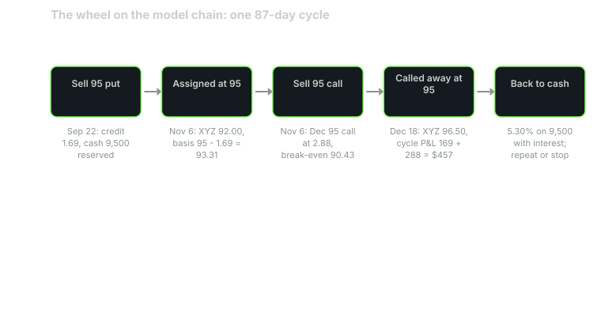

---
{
  "title": "The Wheel: One Full Cycle With Real Numbers",
  "duration": "18 min",
  "free": false,
  "status": "published",
  "quiz": [
    {"q": "In the lesson's cycle you sold the November 95 put at 1.69, were assigned with XYZ at 92.00, and then sold the December 95 call at 2.88. What is your break-even on the shares now?", "opts": ["95.00", "93.31", "90.43", "92.00"], "correct": 2, "explain": "Basis after assignment is 95 - 1.69 = 93.31; the second premium lowers the effective break-even to 93.31 - 2.88 = 90.43."},
    {"q": "XYZ closes at 96.50 on December 18 and the shares are called at 95. Total cycle profit, before interest and commissions?", "opts": ["$457", "$169", "$288", "$607"], "correct": 0, "explain": "Put premium 169 + call premium 288 + stock (95 - 95) x 100 = 0. Total $457 on $9,500 of committed cash over 87 days. The 1.50 above the strike on the final day belongs to the call buyer."},
    {"q": "The wheel loses most, relative to simply holding the stock, when:", "opts": ["The stock drifts sideways", "The stock rallies sharply right after you are assigned and sell the call", "IV falls after entry", "The put expires worthless"], "correct": 1, "explain": "After assignment you are long shares with a short call on top: a rally past the strike is capped at strike plus premium. The wheel's other losing case, a continued decline, loses about as much as holding the stock, less two premiums."},
    {"q": "After assignment XYZ falls to 80 and IV rises to 40%. The December 95 call is worth 0.62 and the December 85 call 2.52. What is wrong with selling the 85 call?", "opts": ["The 85 call has too little premium", "It caps the shares 8.31 below your 93.31 basis, locking in a loss of 5.79 per share if called", "Calls cannot be sold below cost basis", "The 85 call would be a qualified covered call"], "correct": 1, "explain": "If called at 85 you realise 85 + 2.52 = 87.52 against a 93.31 basis: -5.79 per share. Selling calls below basis converts an unrealised loss into a realised one in exchange for premium; sometimes right, never automatic."},
    {"q": "Over the 87-day cycle the wheel earned $457 while 100 shares bought at 100 on September 22 and held to December 18 at 96.50 lost $350. What is the correct interpretation?", "opts": ["The wheel has a structural edge over buy-and-hold", "On this one path, which drifted down then partly recovered, selling premium beat holding; on a path to 115 it would have trailed by over $1,000", "The wheel always outperforms in down markets", "The comparison is invalid because the wheel used less capital"], "correct": 1, "explain": "One path proves nothing. The wheel wins on sideways and mildly down paths and loses on strong rallies, which is the BXM/PUT pattern from Lessons 2 and 3 in miniature."}
  ],
  "task": "Write out a full wheel cycle on paper for a stock you follow: put strike and credit, assignment price and basis, call strike and credit, and the P&L at three closing prices, then compare each to holding the shares from day one."
}
---

## The cycle

The wheel is the cash-secured put and the covered call run in sequence on the same stock. You sell a put; if it expires you sell another; if you are assigned you sell a call on the shares; if the shares are called away you go back to selling puts. Each step is a trade you already know from Lessons 2 and 3. The wheel adds nothing new to the economics; what it adds is a decision rule that keeps you in the market collecting premium, which is either the point or the problem depending on the path.

State the plan before the first ticket, because the wheel's failures are almost all failures of the plan: a put strike you would not actually want to own, a call strike chosen for premium rather than for the basis, and no rule for the stock that keeps falling.

## A full cycle on the model chain

**September 22, 2026.** XYZ 100.00, IV 28%. Sell one November 6 95 put at 1.69. Reserve $9,500. Credit $169. You have committed to buy at 93.31.

**November 6.** XYZ closes at 92.00. The put is 3.00 in the money and you are assigned: 100 shares at 95, $9,500 debited. Basis 93.31 per share. Marked at 92.00 the shares show -$131, and the $169 you collected has already been spent covering the decline from 95 to 93.31. Note what did not happen: you did not lose the premium, and you did not lose more than a stockholder from 95 would have. You own shares at a 6.7% discount to where the stock was 45 days ago, and the stock is 8% lower.

**November 6, after the close.** The chain has moved. XYZ 92.00, IV 32% (it usually rises when a stock falls), next monthly expiration December 18, 42 days. Model call prices from the same Black-Scholes inputs: 92 call 4.19, 95 call 2.88, 97 call 2.20, 100 call 1.42. Sell the December 95 call at 2.88. Credit $288. Your effective break-even is now 93.31 - 2.88 = 90.43, and your maximum result if called is 95 + 2.88 = 97.88 per share.

Why the 95 and not the 92? The 92 call pays 4.19 but caps you at 92 + 4.19 = 96.19, below the 97.88 the 95 call allows, and it is far more likely to be called (delta 0.54 against 0.42). Selling at or above basis is the general rule, because a call below basis converts a paper loss into a realised one. Why not the 100 at 1.42? You could; you would keep more upside and collect half the premium. The choice is the same as in Lesson 2: decide how much upside you sell, then read the price.

**December 18.** Three endings.

*Called away.* XYZ 96.50. The call is assigned and you deliver shares at 95. Cycle total: 169 + 288 + 0 on the stock = $457, on $9,500 committed for 87 days, 4.8%, plus about $47 of interest on the cash during the put leg. The 1.50 of stock above the strike went to the call buyer. You return to step one with cash.

*Expires, still holding.* XYZ 92.00 again. The call expires, you keep the shares, basis unchanged at 93.31 for tax, effective break-even 90.43. Cycle so far: 169 + 288 - 131 unrealised = +$326 marked. Sell another call.

*Falls further.* XYZ 80.00, IV 40%. The call expires. Shares marked at 80: -$1,331. Net with both premiums: -$874. The next chain (model, 42 days, 40% IV) prices the January 95 call at 0.62, the 90 at 1.30, the 85 at 2.52. This is the wheel's real decision point, and there is no rule that makes it painless. Sell the 95 for 0.62 and you earn 0.7% a cycle waiting for a 19% rally; sell the 85 for 2.52 and you have agreed to sell at 85 + 2.52 = 87.52 against a 93.31 basis, a locked loss of 5.79 if called. The wheel does not fix a stock that has fallen 20%. It gives you a slightly better basis than the buyer at 100 and the same exposure.

## Where the wheel loses

Against holding the stock, the wheel has two losing paths and both are large.

**The rally after assignment.** Assigned at 95, call sold at 95 for 2.88, XYZ runs to 110. You are called at 95 and realise $457 for the cycle while a holder from 92 made $1,800. This is the covered-call cap from Lesson 2 applied at the worst moment, right after a drop, when a rebound is most likely to be sharp.

**The rally without assignment.** Sold the 95 put at 100, XYZ runs to 115 by November 6. You keep $169 and never own the stock; a buyer at 100 made $1,500. The put seller's upside is always the premium. Over the 2009 to 2026 bull market this is exactly why the PUT and BXM indexes trailed the S&P 500 (Lessons 2 and 3).

**The continued decline** is a loss but not a relative one: a stock that goes from 100 to 60 costs the wheel about $3,300 (93.31 basis less two or three premiums) and the buyer at 100 $4,000. The wheel loses less, not little. Its real cost here is behavioural: the decision rule says keep selling calls, and the calls that pay anything are below basis.

Against the cash-secured put alone, the wheel's extra risk is the covered-call leg on a stock that has just proven it can fall. Some traders run a "half wheel": sell puts, take assignment, sell the shares at the next close and go back to puts. That gives up the second premium and the second cap. It is a defensible plan on a stock you do not want to hold for long.

## Worked example

Full cycle, per contract, commissions excluded, the called-away ending.

Leg 1, September 22 to November 6: sell 95 put at 1.69. Credit $169. Cash reserved $9,500. Interest on the cash, 45 days at 4%: 9,500 x 0.04 x 45/365 = $46.85.

Assignment, November 6, XYZ 92.00: buy 100 at 95.00 = $9,500. Basis 95.00 - 1.69 = 93.31 per share. Unrealised at 92.00: (92.00 - 93.31) x 100 = -$131.

Leg 2, November 6 to December 18: sell 95 call at 2.88. Credit $288. Effective break-even 93.31 - 2.88 = 90.43. Maximum realisation if called: 95.00 + 2.88 = 97.88.

Close, December 18, XYZ 96.50: assigned at 95.00, proceeds $9,500. Stock gain (95.00 - 95.00) x 100 = $0.

Cycle P&L: 169 + 288 + 0 = $457. With interest: 457 + 46.85 = $503.85. On $9,500 committed for 87 days: 503.85 / 9,500 = 5.30%. Simple annualised, 365/87 = 4.2 cycles: 22.2%. Do not carry that annualised figure into a plan; it is the arithmetic of one path in which the stock fell 8%, recovered 5%, and never rallied past the strike.

Buy-and-hold comparison, 100 shares at 100.00 on September 22, marked December 18 at 96.50: -$350. Difference on this path: $854 in the wheel's favour.

Alternative path, XYZ 115 on November 6: wheel +169 + 46.85 = $215.85; buy-and-hold +$1,500. Difference: $1,284 against the wheel.

Alternative path, XYZ 80 on December 18: wheel 169 + 288 - 1,331 = -$874 marked; buy-and-hold -$2,000. Difference: $1,126 in the wheel's favour, and an open problem.

## Chart

The loop only closes on the path shown. On a falling stock it stalls at the third box; on a rising one it never leaves the first.

## Sources

- Cboe Global Indices, PUT and BXM index dashboards (the two legs of the wheel, run mechanically on the S&P 500): https://www.cboe.com/us/indices/dashboard/put/ and https://www.cboe.com/us/indices/dashboard/bxm/
- Israelov, R. and Nielsen, L. N. (2014), "Covered Call Strategies: One Fact and Eight Myths", *Financial Analysts Journal* 70(6): https://doi.org/10.2469/faj.v70.n6.3
- Internal Revenue Service, Publication 550, "Writers of puts and calls" (basis after assignment): https://www.irs.gov/publications/p550
