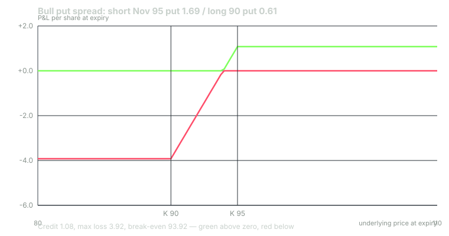

---
{
  "title": "Credit Spreads: Probability of Profit Versus Expected Value",
  "duration": "17 min",
  "free": false,
  "status": "published",
  "quiz": [
    {"q": "Short the November 95 put at 1.69, long the 90 put at 0.61. Credit, maximum loss and break-even per share?", "opts": ["1.08, 5.00, 95.00", "2.30, 2.70, 92.70", "1.08, 3.92, 96.08", "1.08, 3.92, 93.92"], "correct": 3, "explain": "Credit 1.69 - 0.61 = 1.08. Maximum loss = width - credit = 5.00 - 1.08 = 3.92. Break-even = 95 - 1.08 = 93.92."},
    {"q": "At the chain's own 28% volatility, the expected value of any spread sold at mid is:", "opts": ["Positive, because most spreads expire worthless", "Zero, because the mids are the model's fair values; the seller's edge exists only if realised volatility comes in below 28%", "Negative, because of theta", "Equal to the credit times the probability of profit"], "correct": 1, "explain": "The chain was built with one volatility, so every mid is a fair value and every position has zero expected value before costs. Probability of profit describes how often you win, not how much."},
    {"q": "The 90/85 bull put spread collects 0.45 with a 87% probability of profit; the 100/95 collects 1.98 with 58%. Which is true at market fills (paying half the bid/ask each side)?", "opts": ["The 90/85 has the better expected value because it wins more often", "The bid/ask toll is a larger fraction of the 90/85's credit, so its expected value at fills is worse per dollar of credit even though its probability of profit is higher", "Both have identical expected value", "The 100/95 is the safer trade"], "correct": 1, "explain": "The toll is roughly the same in cents on both spreads (about 0.05 to 0.10) but the 90/85 collects a quarter of the premium, so the toll consumes a much larger share of what it can ever earn."},
    {"q": "Why does a 90% probability-of-profit trade still lose money over many repetitions if there is no volatility premium?", "opts": ["Because the 10% loss is roughly nine times the 90% gain, netting to zero before costs and below zero after", "Because probability of profit is calculated incorrectly by brokers", "Because assignment fees exceed the credit", "It does not; 90% POP trades are profitable by definition"], "correct": 0, "explain": "At fair prices the payoff is balanced: P(win) x gain = P(loss) x loss. Costs then tip it negative. Only a volatility premium (implied above realised) makes the expected value positive."},
    {"q": "Short the November 105 call at 2.16 and long the 110 call at 1.00. Which is correct?", "opts": ["Credit 1.16, maximum loss 5.00, break-even 105.00", "Credit 3.16, maximum loss 1.84, break-even 108.16", "Credit 1.16, maximum loss 3.84, break-even 106.16, profits if XYZ is below 106.16 at expiry", "Credit 1.16, maximum loss 3.84, break-even 103.84"], "correct": 2, "explain": "Bear call spread: credit 2.16 - 1.00 = 1.16; max loss 5.00 - 1.16 = 3.84; break-even 105 + 1.16 = 106.16. Probability of profit from the model: 73%."}
  ],
  "task": "For a real chain, compute the credit, maximum loss, break-even and delta-based probability of profit for three bull put spreads at different distances, then compute the bid/ask toll on each as a percentage of its credit."
}
---

## What a credit spread adds

You built all four verticals in the previous course. This lesson uses the two that collect a credit, the bull put spread and the bear call spread, and asks a question that course did not: what is the trade actually worth, as opposed to how often it wins.

On the chain, the bull put spread is short the November 95 put at 1.69 and long the 90 put at 0.61. Credit 1.08. Width 5.00. Maximum loss 5.00 - 1.08 = 3.92. Break-even 95 - 1.08 = 93.92. The bear call spread is short the 105 call at 2.16 and long the 110 call at 1.00: credit 1.16, maximum loss 3.84, break-even 106.16. Both are the cash-secured put or covered call from Lessons 2 and 3 with the tail sold back to the market for the price of the long option. The 90 put costs 0.61, which is 36% of what the 95 put brought in; in exchange the maximum loss falls from $9,331 to $392 and the capital required falls to the same $392.

That is the whole appeal of defined risk: the buying-power reduction is the maximum loss, so sizing is honest by construction, and the loss on a crash is known in advance. The cost is the 0.61, and, less obviously, that the long put's protection only starts at 90. Between 93.92 and 90 the spread loses dollar for dollar just like the naked put.

## Probability of profit

Probability of profit (POP) is the chance the position finishes at expiry above its break-even. From the model, using the same risk-neutral probability you used to read delta, the 95/90 bull put spread has POP = P(XYZ above 93.92) = 1 - 0.261 = 74%. The 100/95 spread (short 100 put 3.67, long 95 put 1.69, credit 1.98, break-even 98.02) has POP 58%. The 90/85 spread (short 90 put 0.61, long 85 put 0.16, credit 0.45, break-even 89.55) has POP 87%.

Broker platforms show these numbers prominently and the natural inference is that the 87% trade is the best one. It is not, and the reason is arithmetic rather than opinion. At a fair price, the expected profit of every one of these spreads is zero: probability of winning times the average win equals probability of losing times the average loss. The 90/85 wins 87% of the time and, when it wins, earns at most 0.45; when it loses it can lose up to 4.55, ten times as much. The 100/95 wins 58% of the time for up to 1.98 and loses up to 3.02. The numbers are balanced by the same price that produced the probabilities.

What POP does tell you is the shape of your equity curve. High-POP trades produce long, smooth runs of small wins and occasional large losses; low-POP trades produce choppier curves with smaller worst cases. Neither shape is an edge.

## Expected value, and where it can come from

Expected value at expiry is the credit minus the expected payout on the short spread. For the 95/90 spread at the model's own 28% volatility the calculation gives -$0.10 per spread at mid: zero, as it must be, up to rounding.

Two things move it. The first is cost. You will not sell at 1.69 and buy at 0.61; you will sell nearer the 1.64 bid and buy nearer the 0.64 ask. Assume you give up half the bid/ask on each leg: the 95 put spread is 0.10 wide, the 90 put 0.06 wide, so the toll is 0.05 + 0.03 = 0.08 and the realistic credit is 1.00. Expected value at that fill: -$8.1 per spread. For the 90/85 spread the toll is 0.03 + 0.02 = 0.05 on a 0.45 credit, fill 0.40, expected value -$4.9. For the 100/95, toll 0.10, fill 1.88, expected value -$11.4. In dollars the far spread loses least, but as a fraction of its credit it loses most: the toll is 11% of what the 90/85 can ever earn, against 5% of the 100/95's credit.

The second is the variance risk premium from Lesson 1. If XYZ realises 24% instead of the 28% implied, the same integration gives expected values at market fills of -$0.5 for the 100/95, +$11.5 for the 95/90 and +$11.1 for the 90/85. Four volatility points of edge are worth about eleven dollars per spread on the two out-of-the-money structures, and nothing on the at-the-money one, whose larger credit is mostly the intrinsic probability of a 100 stock finishing below 100, which a lower realised volatility does not change.

So the answer to "which spread" is not a POP. It is: the trade with a positive expected value after costs, which requires an actual volatility premium, sized so that the 13% to 42% of losing cycles do not end the plan. The next lesson's iron condor is two of these spreads at once; Lesson 8 is about judging whether the premium is rich; Lesson 10 is about the sizing.

## Why high-POP traders still lose

Put the pieces together and the common failure is visible. A trader sells 90/85 spreads for 0.40 at fills, wins seven months in a row (POP 87% makes seven straight wins a 38% event, nothing unusual), books $280 per spread, concludes the method works, and increases size. The eighth month is the one in eight where XYZ finishes below 89.55; with the spread fully in the money the loss is $455 per spread, at three times the original size. The mathematics were never in their favour; the sequence was.

Three habits break the pattern. Compute expected value at your fills, not POP, before every trade. Keep the loss in the max-loss budget (Lesson 10) so that one full loss costs a known, survivable fraction. And measure the strategy in dollars per unit of capital over enough cycles to mean something (Lesson 12), rather than in win rate.

## Worked example

Bull put spread: short November 95 put, long November 90 put. Per spread, commissions excluded.

At mids: credit 1.69 - 0.61 = 1.08 ($108). Maximum loss 5.00 - 1.08 = 3.92 ($392). Break-even 95 - 1.08 = 93.92. Buying-power reduction $392 (Reg T and portfolio margin alike, Lesson 10). Return on capital if it expires worthless: 108 / 392 = 27.6% for 45 days.

POP from the model: P(XYZ above 93.92 at expiry) = 74%. Check the balance at fair value: 0.74 x average win must equal 0.26 x average loss. Average win is a little under the full 1.08 (some wins are partial, between 93.92 and 95); average loss is a little under 3.92. The model's integration confirms: expected value at mid -$0.1, i.e. zero.

At market fills: sell the 95 put at 1.64 (bid), buy the 90 put at 0.64 (ask): credit 1.00. Half-spread assumption instead: 1.69 - 0.05 = 1.64 received and 0.61 + 0.03 = 0.64 paid, same result, credit 1.00 ($100). Maximum loss 4.00 ($400). Break-even 94.00. POP 74% (barely changed). Expected value at 28% realised: -$8.1. Expected value at 24% realised: +$11.5.

Bear call spread, same method: short 105 call 2.16, long 110 call 1.00. Credit 1.16, maximum loss 3.84, break-even 106.16, POP = P(XYZ below 106.16) = 73%. At half-spread fills (0.05 + 0.04): credit 1.07, maximum loss 3.93.

Together, the two spreads are the iron condor's near cousin, with the short strikes 5 wide of the stock instead of 10; the next lesson moves them out.

## Chart

Read the two charts together: the payoff diagram shows how a spread wins and loses; the bars show that how often it wins says nothing about whether it is worth doing.

## Sources

- Options Clearing Corporation, *Characteristics and Risks of Standardized Options*, spreads and margin: https://www.theocc.com/company-information/documents-and-archives/options-disclosure-document
- Cboe Global Markets, Margin Manual (spread requirements): https://www.cboe.com/us/options/strategy_based_margin/
- Carr, P. and Wu, L. (2009), "Variance Risk Premiums", *Review of Financial Studies* 22(3): https://doi.org/10.1093/rfs/hhn038
- FINRA Rule 4210, Margin Requirements: https://www.finra.org/rules-guidance/rulebooks/finra-rules/4210
