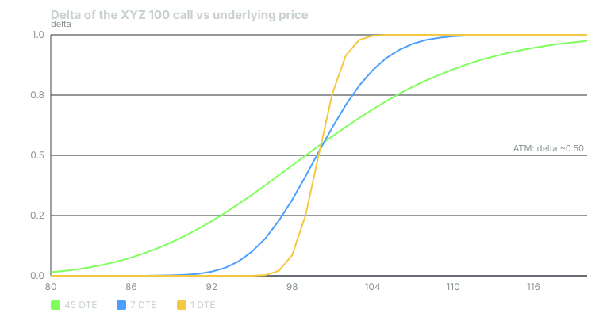

---
{
  "title": "Delta: Probability, Leverage, Hedge Ratio",
  "duration": "16 min",
  "free": false,
  "status": "published",
  "quiz": [
    {"q": "The XYZ 100 call has delta 0.54. XYZ rises from 100.00 to 101.00. Ignoring other effects, the call moves from 4.16 to about:", "opts": ["4.70", "5.16", "4.16", "4.62"], "correct": 0, "explain": "A delta of 0.54 means about 0.54 per 1.00 move in the stock: 4.16 + 0.54 = 4.70. (Gamma will nudge it slightly higher; Lesson 7.)"},
    {"q": "Which reading of delta is used when a trader says 'the 35-delta call'?", "opts": ["The call has 35% leverage", "The call is roughly 35% likely to expire ITM", "The call moves 35 cents per 1% stock move", "The call needs 35 shares to hedge"], "correct": 1, "explain": "Delta is widely used as a rough probability of finishing in the money. A 0.35-delta call is about a one-in-three shot; it is an approximation, not the exact model probability."},
    {"q": "You own 300 shares of XYZ and want to be approximately delta-neutral using the 100 put (delta -0.46). How many puts?", "opts": ["3", "6 to 7", "1", "46"], "correct": 1, "explain": "300 shares is +300 delta. Each put is -46 delta. 300 / 46 = 6.5, so 6 or 7 puts. Three puts would only hedge 138 shares' worth."},
    {"q": "Which option's delta will change the most for a 2.00 move in the stock?", "opts": ["A 0.96-delta deep ITM call", "A 0.54-delta ATM call", "A 0.09-delta far OTM call", "They change equally"], "correct": 1, "explain": "Delta changes fastest at the money, where gamma is highest. Deep ITM and far OTM deltas are near 1 and 0 and barely move."},
    {"q": "Put deltas are:", "opts": ["Between 0 and +1", "Between -1 and 0", "Always exactly -0.50", "The same as call deltas at the same strike"], "correct": 1, "explain": "A put gains when the stock falls, so its delta is negative. At the same strike and expiry, call delta minus put delta equals about 1 (exactly e^(-qT) with dividends)."}
  ],
  "task": "On a real chain, find the call whose delta is closest to 0.30 and the put closest to -0.30 at 30 to 45 DTE, and note how far each strike sits from the stock price in percent."
}
---

## One number, three jobs

Delta is the most quoted Greek because it answers three different questions at once. How much will my option move if the stock moves one dollar? Roughly how likely is this option to finish in the money? How many shares does this option behave like, so how many would hedge it? Each reading is useful; each is an approximation; and the signal cards report delta precisely because one number tells you so much about a contract.

Formally, delta is the rate of change of the option price with respect to the underlying price. Call deltas run from 0 (far OTM) to 1 (deep ITM). Put deltas run from -1 to 0. An ATM option has a delta near 0.50 for the call and -0.50 for the put; with positive interest and no dividend the ATM call sits slightly above 0.50, which is why the XYZ 100 call shows 0.54 rather than 0.50.

## Delta as a price sensitivity

The first reading is the definition. If the XYZ 100 call has delta 0.54 and XYZ rises 1.00, the call rises about 0.54, from 4.16 to about 4.70. If XYZ falls 1.00, the call falls about 0.54. Per contract, multiply by 100: a 1.00 move in the stock moves the position about $54.

This is a local estimate. Delta itself changes as the stock moves (that is gamma, Lesson 7), so for large moves the linear estimate under-predicts gains on the winning side and over-predicts losses on the losing side. For a 1.00 move on a $100 stock at 45 DTE the error is a few cents; for a 5.00 move it is meaningful.

Brokers report **position delta** by summing delta times quantity times 100 across every leg. A trader long two 100 calls (0.54 each) and short one 105 call (0.35) has position delta (2 x 0.54 - 1 x 0.35) x 100 = +73. Their book behaves, for small moves, like 73 shares.

## Delta as a probability

The second reading comes from the pricing model. In the Black-Scholes framework, N(d2) is the risk-neutral probability of finishing in the money, and call delta N(d1) is close to it for short-dated options with moderate volatility. So traders use delta as a quick probability: a 0.30-delta call is roughly a 30% chance of expiring ITM, a 0.54-delta call is roughly a coin flip with a slight edge.

Three caveats keep this honest. It is the model's probability, not the market's forecast of where the stock goes; it assumes the option is held to expiration; and delta overstates the ITM probability by a little because N(d1) is greater than N(d2). For the XYZ 100 call the exact model figure is N(d2) = 0.50 against delta 0.54. The gap grows with volatility and time.

The probability reading is why strikes are often chosen by delta rather than by dollars. "Sell the 16-delta put" means "sell the put with roughly a one-in-six chance of finishing in the money, wherever that strike happens to be today". It adapts automatically to the stock's volatility; a 5%-OTM strike does not.

## Delta as leverage

The third reading is about what you get per dollar spent. The 100 call costs 4.16 and moves like 54 shares. Fifty-four shares of XYZ cost $5,400; the call costs $416. For a small move the call gives you 54 shares of exposure for 7.7% of the capital, an effective leverage of about 13 times. That leverage is the reason options can produce large percentage gains and the reason a modest move against you can take a large percentage of the premium.

Leverage is highest for OTM options in percentage terms and lowest deep ITM. The 110 call, delta 0.19 on a 1.00 premium, moves like 19 shares ($1,900 of stock) for $100 of premium: 19 times. The 90 call, delta 0.88 on 11.05, moves like 88 shares ($8,800) for $1,105: 8 times. OTM options are cheaper and more leveraged; they are also more likely to expire worthless. Lesson 9 turns this trade-off into a strike-selection rule.

## Delta as a hedge ratio

The original use of delta, from the Black-Scholes derivation itself, is as a hedge ratio: the number of shares that offsets the option's price change. A market maker short one 100 call (delta 0.54) buys 54 shares to be flat to small moves. An investor long 100 shares who wants to cut exposure with puts needs enough negative put delta to cancel +100 of share delta.

Hedging with delta is a moving target. As the stock moves, delta moves, and the hedge has to be rebalanced. Lesson 7 shows why this rebalancing cost is exactly the value of gamma.

## Delta across strikes and time

Two regularities are worth knowing by heart. Across strikes at a fixed expiry, delta rises smoothly from near 0 to near 1 as you move from far OTM to deep ITM, with the steepest part of the curve at the money. Across time at a fixed strike, ITM deltas rise toward 1 and OTM deltas fall toward 0 as expiration approaches, and the transition zone around the money gets narrower. The day before expiration, a call one dollar ITM has delta near 0.76 and a call one dollar OTM has delta near 0.25; the same two calls at 45 DTE have deltas of about 0.58 and 0.50.

## Worked example

XYZ at 100.00, November 6 expiration, 45 DTE, representative chain from a 28% IV model, 4% rate.

Model deltas from the chain: 90 call 0.88, 95 call 0.73, 100 call 0.54, 105 call 0.35, 110 call 0.19, 115 call 0.09; 100 put -0.46, 95 put -0.27.

**Sensitivity.** XYZ rises 2.00 to 102.00. Linear estimate for the 100 call: 4.16 + 0.54 x 2 = **5.24**. The full model value at 102.00 is 5.32; the 0.08 gap is gamma. For the 105 call: 2.16 + 0.35 x 2 = 2.86 (model 2.90).

**Probability.** The 105 call at delta 0.35 is read as about a 35% chance of XYZ closing above 105 on 6 November. The 110 call at 0.19 is about one in five. The 100 put at -0.46 is about a 46% chance of finishing below 100.

**Leverage.** The 100 call: 54 shares of exposure per $416, or 100 x 0.54 x 100 / 416 = **13.0x**. The 110 call: 100 x 0.19 x 100 / 100 = **19.2x**. The 90 call: 100 x 0.88 x 100 / 1,105 = **8.0x**.

**Hedge ratio.** You hold 200 XYZ shares (+200 delta) into an event and want to cut that to roughly zero with November 100 puts at delta -0.46. Puts needed = 200 / 46 = 4.35, so **4 puts** leaves +16 delta and **5 puts** leaves -30 delta. Cost at the 3.73 ask: 4 x 373 = $1,492 for the four-put hedge. If XYZ falls 5.00 tomorrow, the shares lose $1,000 and the four puts gain about 4 x 0.46 x 5 x 100 = $920 before gamma, which adds a further cushion, so the book is close to flat.

**Position delta of a spread.** Long the 100 call (0.54), short the 105 call (0.35): position delta = (0.54 - 0.35) x 100 = **+19** per spread. The spread costs 2.00 (Lesson 10) and behaves like 19 shares for small moves.

## Chart

Read the three curves at XYZ = 102: delta is 0.62 at 45 DTE, 0.71 at 7 DTE and 0.91 at 1 DTE. At XYZ = 98 they are 0.46, 0.32 and 0.09. The near-dated curve is a cliff; the far-dated curve is a ramp. That steepness is gamma, and it is the subject of Lesson 7.

## Reading delta on a signal card

When a card reads "XYZ 105C, 45 DTE, delta 0.35", you can now translate it three ways before you decide anything: the position moves about $35 per contract per dollar of XYZ; the model gives it roughly a one-in-three chance of expiring in the money; and it carries the exposure of 35 shares for the price of 2.16 x 100 = $216. All three are approximations, and all three change as the stock and the calendar move.

## Sources

- Black, F. and Scholes, M. (1973), "The Pricing of Options and Corporate Liabilities", *Journal of Political Economy* 81(3): https://www.jstor.org/stable/1831029
- Cboe Global Markets, Options Institute, the Greeks: https://www.cboe.com/education/
- Options Clearing Corporation, *Characteristics and Risks of Standardized Options*: https://www.theocc.com/company-information/documents-and-archives/options-disclosure-document
