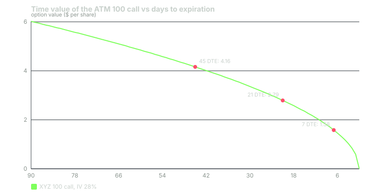

---
{
  "title": "Theta and the Time Decay Curve",
  "duration": "15 min",
  "free": false,
  "status": "published",
  "quiz": [
    {"q": "The XYZ 100 call is 4.16 with theta -0.049. If nothing else changes, tomorrow it is worth about:", "opts": ["4.21", "4.11", "4.16", "3.67"], "correct": 1, "explain": "Theta is the change in value per calendar day, so 4.16 - 0.049 = 4.11 per share, or about $5 per contract."},
    {"q": "An ATM option worth 6.02 at 90 DTE is worth about 4.16 at 45 DTE (same stock price and IV). Over the second 45 days it will lose:", "opts": ["Another 1.86, at the same pace", "Less than 1.86, because decay slows", "All 4.16, and the pace accelerates", "Nothing until the final week"], "correct": 2, "explain": "At expiration the ATM option is worth zero, so the remaining 4.16 goes in 45 days versus 1.86 in the first 45. ATM time value decays roughly with the square root of time remaining, so it accelerates."},
    {"q": "Which option loses the largest share of its premium to theta each day?", "opts": ["The 95 call (theta -0.043 on 7.15)", "The 100 call (theta -0.049 on 4.16)", "The 110 call (theta -0.032 on 1.00)", "They are equal"], "correct": 2, "explain": "0.032 / 1.00 = 3.2% per day, versus 1.2% for the ATM and 0.6% for the ITM call. ATM options lose the most dollars; OTM options lose the most percent."},
    {"q": "Theta is quoted per calendar day. What does this imply about holding a long option over a weekend?", "opts": ["No decay, markets are closed", "About two days of decay is priced in between Friday's close and Monday's open, and much of it is often reflected in Friday's quotes", "Decay doubles permanently", "Theta resets to zero on Monday"], "correct": 1, "explain": "The model counts calendar days, so a Friday-to-Monday hold spans three days of theta. Market makers typically shade Friday quotes to anticipate some of it."},
    {"q": "For which trader is theta a source of income rather than a cost?", "opts": ["A long call holder", "A long put holder", "A short option writer", "Nobody; theta is always a cost"], "correct": 2, "explain": "Theta is negative for long options and positive for short options. The writer collects the decay the buyer pays, in exchange for taking on gamma and assignment risk."}
  ],
  "task": "Take any liquid ATM call at about 45 DTE, note its mid and theta, and check back in five trading days with the stock at roughly the same price; compare the actual drop to 5 to 7 times the quoted theta."
}
---

## The one Greek that never sleeps

Theta is the change in an option's value for the passage of one calendar day, with the stock price, volatility and interest rate held fixed. For a long option theta is negative: every day that passes with nothing else happening, the option is worth a little less. For a short option it is positive. Theta is the price of time value, paid out day by day, and Lesson 3 already told you where time value is largest, so you already know where theta is largest: at the money.

Brokers quote theta per share per day. A theta of -0.049 on the XYZ 100 call means the contract loses about 0.049 x 100 = $4.90 a day at the current stock price and volatility. Over a week that is about $34, or 8% of the $416 premium, without the stock moving at all.

## Theta is not constant

The single most important thing about theta is that it grows as expiration approaches. Time value does not drain at a steady rate; for an ATM option it drains roughly in proportion to the square root of time remaining. Halve the time to expiration and the ATM option loses about 30% of its value, not 50%. That means the first half of an option's life costs the buyer less than the second half, and the final two or three weeks are the most expensive of all.

The XYZ 100 call illustrates. At 90 DTE it is worth 6.02. At 45 DTE, with the stock and IV unchanged, it is 4.16: a loss of 1.86 over 45 days, about 0.041 a day. From 45 DTE to 21 DTE it falls to 2.79: 1.37 in 24 days, 0.057 a day. From 21 DTE to 7 DTE it falls to 1.58: 1.21 in 14 days, 0.086 a day. From 7 DTE to expiration it loses the last 1.58 in 7 days, 0.226 a day. The daily bill roughly quintuples between the first month and the last week.

This is why a **DTE** field sits on every signal card. Two identical-looking 100 calls at 45 DTE and 7 DTE are different products: the first costs about 1.2% of its value per day to hold, the second about 7%.

## Theta by moneyness

At a fixed expiration, theta in dollars is largest at the money and smaller both ITM and OTM, exactly like time value. Theta as a percentage of premium is a different story. The 95 call loses 0.043 a day on a 7.15 premium: 0.6% a day. The 100 call loses 0.049 on 4.16: 1.2%. The 110 call loses 0.032 on 1.00: 3.2%. The 115 call loses 0.019 on 0.41: 4.6%.

So the cheap OTM options that look like bargains on the chain are the ones that decay fastest as a proportion of what you paid. Combine that with the wide relative spreads from Lesson 2 and you have the two reasons far-OTM long options are difficult to hold profitably.

## What theta is paying for

Theta is not a fee for nothing. The buyer pays theta in exchange for gamma, the right to have delta move in their favour as the stock moves (Lesson 7). The writer collects theta in exchange for carrying the opposite exposure: the risk that a large move overwhelms the premium collected. In a fairly priced option, the expected gamma gains and the theta cost roughly cancel; there is no free income in selling options, only a different shape of risk. Any claim that theta is "free money" is a claim that the option is mispriced, and that needs evidence.

For an ATM option a useful relationship is that daily theta is approximately half of gamma times the stock price squared times the daily variance. For the XYZ 100 call: 0.5 x 0.040 x 100^2 x 0.28^2 / 365 = 0.043, close to the quoted 0.049; the remainder is the interest component. You do not need to memorise this. You need to remember that theta and gamma are two sides of one coin.

## Calendar days, trading days and weekends

Models count calendar days, so theta is quoted per calendar day and a Friday-to-Monday hold spans three of them. In practice market makers shade their Friday quotes lower to anticipate weekend decay, so the drop you see between Friday's close and Monday's open is usually smaller than three times theta, and part of it happened during Friday's session. The net effect is the same: time value leaves whether or not the market is open.

Holidays and half days behave similarly. None of this changes the decision rule; it only changes when the decay shows up on your screen.

## Worked example

XYZ at 100.00, representative chain, 28% IV, 4% rate. You buy the November 6 100 call at the 4.16 mid on 22 September (45 DTE). Assume XYZ stays at 100.00 and IV stays at 28% for the whole period, so the only thing acting on the price is time.

Model values of the 100 call at each checkpoint:

| Date | DTE | Model value | Cumulative loss | Loss this period | Per calendar day |
|---|---|---|---|---|---|
| 22 Sep | 45 | 4.16 | 0.00 | | |
| 7 Oct | 30 | 3.36 | 0.80 | 0.80 over 15 days | 0.053 |
| 16 Oct | 21 | 2.79 | 1.37 | 0.57 over 9 days | 0.063 |
| 23 Oct | 14 | 2.26 | 1.90 | 0.53 over 7 days | 0.076 |
| 30 Oct | 7 | 1.58 | 2.58 | 0.68 over 7 days | 0.097 |
| 5 Nov | 1 | 0.59 | 3.57 | 0.99 over 6 days | 0.165 |
| 6 Nov | 0 | 0.00 | 4.16 | 0.59 over 1 day | 0.590 |

Reading it: by 21 DTE, a third of the premium is gone with the stock exactly where you bought it. By 7 DTE, 62%. The final week costs 1.58, more than the first 24 days combined (1.37). The quoted theta of -0.049 at entry described only the first few days; averaged over the full 45 days, decay ran at 4.16 / 45 = 0.092 a day, almost double.

Now put a move in. Suppose XYZ rises to 104.00 by 16 October (21 DTE). The 100 call's model value is 5.35, so you are up 5.35 - 4.16 = 1.19. Your delta gain was roughly 0.54 x 4 = 2.16 plus gamma; theta took 1.37 of it back. The stock did what you wanted, and you kept about half the directional gain. Had the same 4.00 move happened by 7 October (30 DTE) instead, the call would have been worth 6.11 and you would have kept 1.95 of it. Timing is not a detail in long-option trades; it is the trade.

## Chart

The curve is nearly a straight line for the first sixty days and bends sharply in the last three weeks. Every long-option rule in Lesson 9 about entry DTE and exit DTE is a rule about staying on the flat part of this curve.

## Using theta in decisions

Three practical uses. First, before buying an option, divide its theta by its price to get the daily percentage cost of being wrong on timing; if that number is above 2% you are paying a high rent and need the move soon. Second, when planning a long option trade, choose an entry DTE that puts your expected holding period on the flat part of the curve and plan to exit before the bend, typically with 14 to 21 days left, even if the thesis has not played out. Third, when selling options, remember that the theta you collect is compensation for gamma risk, and it is largest in exactly the last two weeks where the gamma risk is also largest. Lessons 7 and 10 make both sides of that trade concrete.

## Sources

- Black, F. and Scholes, M. (1973), "The Pricing of Options and Corporate Liabilities", *Journal of Political Economy* 81(3): https://www.jstor.org/stable/1831029
- Cboe Global Markets, Options Institute, time decay and theta: https://www.cboe.com/education/
- Options Clearing Corporation, *Characteristics and Risks of Standardized Options*: https://www.theocc.com/company-information/documents-and-archives/options-disclosure-document
