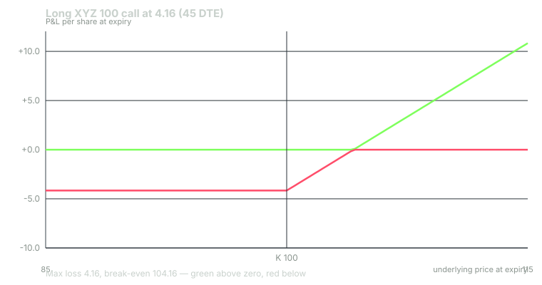
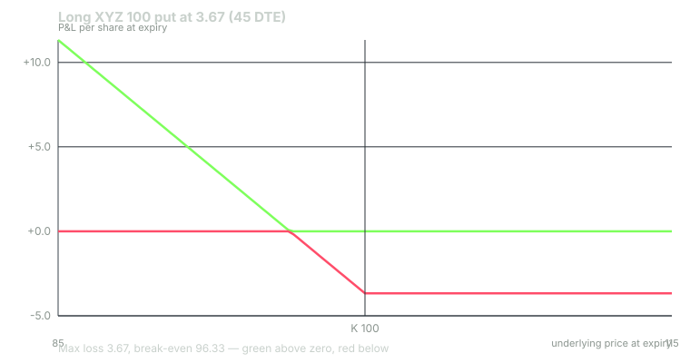

---
{
  "title": "Long Calls and Puts Done Right",
  "duration": "17 min",
  "free": false,
  "status": "published",
  "quiz": [
    {"q": "The XYZ 100 call is quoted 4.08 x 4.24 and your broker charges $0.65 per contract per side. Your round-trip cost as a percent of the 4.16 mid, if you buy at the ask and sell at the bid, is about:", "opts": ["0.3%", "1.9%", "4.2%", "8.0%"], "correct": 2, "explain": "Spread 0.16 plus commissions 2 x 0.65 / 100 = 0.013, total 0.173 per share; 0.173 / 4.16 = 4.2%. The option must gain that much before you are flat."},
    {"q": "For a directional long call held two to four weeks, which combination keeps you on the flat part of the decay curve and away from the worst relative spreads?", "opts": ["0.10 delta, 7 DTE", "Any delta, 0DTE", "0.90 delta, 2 DTE", "0.55 to 0.70 delta, 45 to 60 DTE, exit by 21 DTE"], "correct": 3, "explain": "Higher delta means more intrinsic value and less time value to decay; 45 to 60 DTE keeps theta modest; exiting near 21 DTE avoids the steep final weeks and the gamma cliff."},
    {"q": "You bought the 100 call at 4.24. Your plan says exit at 21 DTE regardless. At 21 DTE XYZ is 100.00 and the call is 2.79 bid 2.71. Your P&L per contract, including two $0.65 commissions, is:", "opts": ["-$145", "-$154.30", "+$0", "-$424"], "correct": 1, "explain": "(2.71 - 4.24) x 100 = -153, less 1.30 in commissions = -$154.30. The stock did nothing and theta took 36% of the premium."},
    {"q": "The 115 call is quoted 0.38 x 0.44. Why is it a poor vehicle for a directional trade even if you are right about direction?", "opts": ["It has too much intrinsic value", "Its relative spread is about 15% and its delta is 0.09, so it needs a very large, fast move to overcome costs and decay", "It cannot be sold before expiration", "It has negative vega"], "correct": 1, "explain": "0.06 / 0.41 = 14.6% round-trip spread, plus 4.6% per day of theta, and a 0.09 delta means the stock must move far and soon. The cheapness is the problem, not the attraction."},
    {"q": "Which is a valid exit rule for a long option position?", "opts": ["Hold to expiration in all cases to avoid paying the spread twice", "Add contracts when the position is down 50% to lower the average cost", "Predefine a profit target, a loss stop as a percent of premium, and a time stop by DTE, and take whichever comes first", "Exit only when delta reaches 1.00"], "correct": 2, "explain": "A long option needs three exits defined before entry: target, stop and time. Averaging down into a decaying asset and holding through the final week are the two most common ways a small loss becomes a total one."}
  ],
  "task": "Write a one-page trade plan for a hypothetical long call using the template in this lesson, with strike, DTE, entry price, target, stop, time stop and size, and compute the round-trip cost hurdle in percent."
}
---

## The simplest trade is the easiest to do badly

Buying a call or a put is the first options trade most people make and the one most often done wrong. The reasons are all in the previous lessons: buyers pay time value that decays (Lesson 5), pay a spread that is widest in relative terms on the cheap options they are drawn to (Lesson 2), pay for volatility that tends to fall after they buy (Lesson 6), and hold into the final weeks where gamma turns the position into a coin flip (Lesson 7). None of that makes long options a bad trade. It makes them a trade that needs a plan for strike, DTE, exits and cost, in that order, before the order ticket is opened.

## The round-trip cost hurdle

Start with the cost, because it decides which contracts are even eligible. A long option is bought at or near the ask and sold at or near the bid, and each side carries a commission. The **round-trip cost** is (ask - bid) + 2 x commission per share, and the **hurdle** is that cost as a percentage of the mid: the gain the option must make before you are back to zero.

For the XYZ 100 call at 4.08 x 4.24 with a $0.65 commission: spread 0.16, commissions 1.30 / 100 = 0.013, total 0.173, hurdle 0.173 / 4.16 = **4.2%**. For a retail account on a liquid ATM option at 45 DTE, a hurdle of around 4% is typical, and that is the benchmark to hold every candidate contract against. If the hurdle is above about 5%, the contract is too expensive to trade unless the expected move is unusually large. The 110 call at 0.96 x 1.04: (0.08 + 0.013) / 1.00 = 9.3%. The 115 call at 0.38 x 0.44: (0.06 + 0.013) / 0.41 = 17.8%. Both are cheap in dollars and expensive in the only unit that matters.

The hurdle is a floor, not the full cost. Theta adds a daily charge on top: 1.2% a day for the ATM call, 4.6% a day for the 115 call. A contract with a 4% hurdle and 1.2% daily decay held for ten days needs the stock to deliver roughly a 16% gain in the option, about 1.25 in the stock at a 0.54 delta, just to break even. Write that number down before you buy.

## Strike selection

Choose strike by delta, not by price. For a directional long call or put with a holding period of two to four weeks, a delta between about 0.55 and 0.70 (slightly ITM) is the workhorse. It has three advantages over the OTM strikes that look cheaper: a larger share of the premium is intrinsic value, which does not decay; the relative spread is tighter; and the position gains meaningfully on a moderate move rather than needing a large one. The cost is a bigger premium per contract and therefore a larger dollar loss if the stock moves against you, which sizing handles (Lesson 12).

On the XYZ chain the 95 call (delta 0.73, 7.15, of which 5.00 intrinsic) is the higher-delta choice, the 100 call (0.54, 4.16, all time value) the ATM choice, and the 105 call (0.35, 2.16) the OTM choice. For puts, mirror it: the 105 put (delta -0.65) is the higher-delta choice.

There is a legitimate case for low-delta OTM options: when you expect a very large, fast move and are prepared to lose the whole premium most of the time. That is a different trade with a different sizing rule, not a cheaper version of this one.

## DTE selection

Buy more time than you think you need. Enter at 45 to 60 DTE for a two-to-four-week hold. The decay curve is nearly flat there (Lesson 5), vega is moderate, and gamma is low enough that the delta on the card still means something the next morning. Plan to be out by about 21 DTE whether or not the thesis has played out; the last three weeks cost the most per day and are where a position that is "almost working" gets eaten.

Do not buy weekly or 0DTE options for a multi-day thesis. If a thesis needs a specific short window, such as an event, that is an event trade (Lesson 6's IV crush applies) and a spread is usually the right structure (Lesson 10).

## Exit rules

Every long option position needs three exits defined before entry, and the first one to trigger closes the trade.

1. **Profit target.** Either a stock price where the thesis is complete, or a percentage of premium. A common framework is to take at least half off at 50% to 100% gain on premium. Gamma argues for letting a working position run; theta argues for not letting it sit. A target resolves the argument in advance.
2. **Loss stop.** A percentage of premium, commonly 40% to 50%, or a stock level that invalidates the thesis, whichever comes first. A long option cannot be margin-called, so the only thing that enforces a stop is you.
3. **Time stop.** The DTE at which you exit regardless, typically 21 DTE for a 45-to-60 DTE entry. This is the rule most often broken and the one that most often turns a 40% loss into a 100% loss.

Never average down into a long option. The premium you add is more time value bought at a later date, and the time stop arrives just as fast for the new contracts.

## Worked example

XYZ at 100.00 on 22 September 2026. Representative chain, 28% IV, 4% rate, $0.65 per contract per side.

**The plan.** Thesis: XYZ reaches 106 within three weeks. Vehicle: November 6 (45 DTE) 100 call, delta 0.54. Entry 4.24 at the ask, $424 plus $0.65. Cost hurdle: 0.173 / 4.16 = 4.2%. Target: 100% of premium (sell at 8.48) or XYZ at 106, whichever first. Stop: 50% of premium (sell at 2.12) or a close below 97. Time stop: 16 October (21 DTE).

**Break-even at expiration:** 100 + 4.24 = 104.24. Probability of XYZ above 104.24 on 6 November, from the model: about **34%**. That is what you are buying if you hold to expiration and is the reason you will not.

**Outcomes at the time stop (21 DTE, 16 October), selling at the bid, taken as model value less 0.08.**

| XYZ on 16 Oct | Model value | Sale at bid | P&L per contract | Return on premium |
|---|---|---|---|---|
| 96 | 1.16 | 1.08 | (1.08 - 4.24) x 100 - 1.30 = -$317.30 | -75% |
| 100 | 2.79 | 2.71 | -$154.30 | -36% |
| 104 | 5.35 | 5.27 | +$101.70 | +24% |
| 108 | 8.64 | 8.56 | +$430.70 | +102% |

The stop at 2.12 would have triggered before the 96 row was reached; the 96 row shows what holding to the time stop costs if you ignore the price stop. The 100 row is the honest baseline: being right that XYZ would not fall, and wrong that it would rise, costs 36%.

**The same thesis with the 95 call (delta 0.73), entry at the 7.25 ask.** At 21 DTE and XYZ = 104 the model value is 9.47; sale at 9.37 gives (9.37 - 7.25) x 100 - 1.30 = **+$210.70**, or +29% on a larger premium. At XYZ = 100: 6.01, sale at 5.91, -$135.30, or -19%. The ITM call gains more dollars on the move and loses fewer percent on no move, because 5.00 of its 7.25 was intrinsic value that never decayed.

**The same thesis with the 110 call (delta 0.19), entry at the 1.04 ask.** At XYZ = 104: model 0.86, sale at 0.82, (0.82 - 1.04) x 100 - 1.30 = **-$23.30**. The stock rose 4% in three weeks and the OTM call still lost money. At XYZ = 108: 2.13, sale at 2.09, +$103.70. It needed the full 8% move.

**The long put.** Mirror thesis: XYZ to 94. November 100 put at the 3.73 ask, delta -0.46, break-even at expiration 100 - 3.73 = 96.27, model probability about **35%** of finishing below it. Hurdle: (0.12 + 0.013) / 3.67 = 3.6%. Same target, stop and time-stop structure.

## Chart

The expiration payoff is the worst case for a long option: flat below the strike, one-for-one above. At 21 DTE the value curve sits above this line everywhere because time value remains, which is exactly why the plan exits at 21 DTE rather than waiting for the line.

## The plan template

Before any long option order: ticker and thesis in one sentence; strike and delta; expiration and DTE; entry price and whether it is the ask or a limit at mid; round-trip hurdle in percent; daily theta as a percent of premium; profit target in premium and in stock price; stop in premium and in stock price; time stop in DTE; number of contracts from Lesson 12's sizing rule. If any line is blank, the trade is not ready. The signal cards give you delta, DTE, spread cost and moneyness for the first half of that list; the second half is yours to write.

## Sources

- FINRA, Investor Insights, options trading and the risks of buying options: https://www.finra.org/investors/investing/investment-products/options
- Options Clearing Corporation, *Characteristics and Risks of Standardized Options*: https://www.theocc.com/company-information/documents-and-archives/options-disclosure-document
- Cboe Global Markets, Options Institute, long call and long put strategies: https://www.cboe.com/education/
- U.S. Securities and Exchange Commission, Investor Bulletin: An Introduction to Options: https://www.sec.gov/investor/alerts/ib_introductionoptions.pdf
