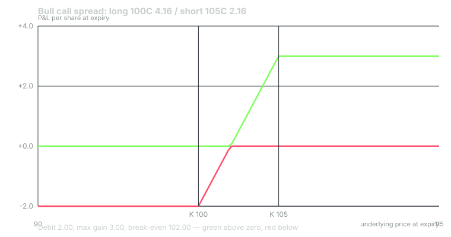
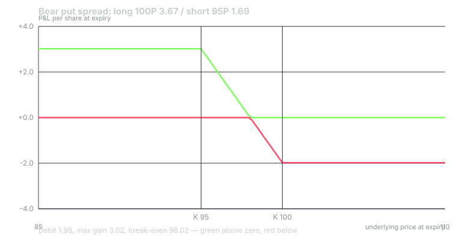
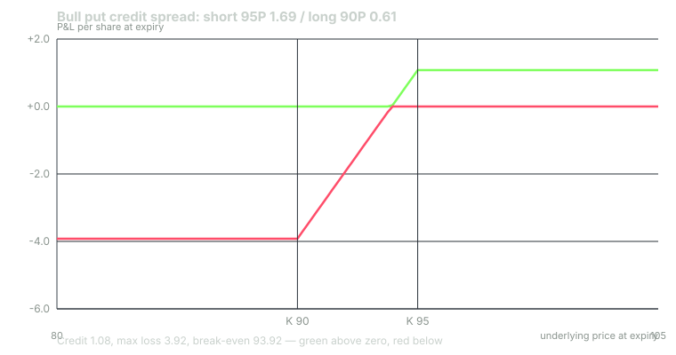

---
{
  "title": "Vertical Spreads: Debit and Credit",
  "duration": "18 min",
  "free": false,
  "status": "published",
  "quiz": [
    {"q": "You buy the XYZ 100 call at 4.16 and sell the 105 call at 2.16. Max loss, max gain and break-even at expiration are:", "opts": ["2.00 / 3.00 / 102.00", "4.16 / 5.00 / 104.16", "2.00 / 5.00 / 100.00", "3.00 / 2.00 / 103.00"], "correct": 0, "explain": "Debit 4.16 - 2.16 = 2.00 is the max loss. Max gain = width - debit = 5.00 - 2.00 = 3.00. Break-even = lower strike + debit = 102.00."},
    {"q": "You sell the 95 put at 1.69 and buy the 90 put at 0.61. Max loss and break-even are:", "opts": ["1.08 / 96.08", "3.92 / 93.92", "5.00 / 95.00", "0.61 / 89.39"], "correct": 1, "explain": "Credit 1.69 - 0.61 = 1.08. Max loss = width - credit = 5.00 - 1.08 = 3.92. Break-even = short strike - credit = 95 - 1.08 = 93.92."},
    {"q": "A bull call debit spread at strikes 95/100 and a bull put credit spread at strikes 95/100 have:", "opts": ["Opposite payoffs", "Nothing in common", "The same max loss but different break-evens", "The same payoff at expiration, by put-call parity"], "correct": 3, "explain": "Both are long the 95 and short the 100 with the same direction; parity makes the call-side and put-side versions economically equivalent (debit 2.99 versus credit 1.98 on a 5-wide spread, differing by the rate effect)."},
    {"q": "Which environment favours a credit spread over a debit spread for the same directional view?", "opts": ["Low IV rank, because options are cheap to buy", "High IV rank, because the premium collected is rich and IV tends to revert", "It never matters", "Only on 0DTE"], "correct": 1, "explain": "A credit spread is short vega; it benefits from IV falling. When IV rank is high, selling the richer premium and defining risk with the long leg is the usual choice; when IV rank is low, buying the debit spread is."},
    {"q": "The spread's round-trip cost is higher in relative terms than a single option's because:", "opts": ["You cross two bid-ask spreads and pay four commissions on a smaller net premium", "Spreads are illegal to trade at mid", "The OCC charges a spread fee", "Spreads have more vega"], "correct": 0, "explain": "Two legs each cross a half-spread on entry and exit, and each leg carries a commission both ways. On the 100/105 call spread that is about 0.16 on a 2.00 debit, about 8%, versus 4.2% for the single 100 call."}
  ],
  "task": "On a real chain, build one debit spread and one credit spread five points wide at 30 to 45 DTE and compute max loss, max gain, break-even and the round-trip cost as a percent of the net premium for each."
}
---

## Two legs, defined risk

A **vertical spread** is a long option and a short option of the same type, same expiration, different strikes. "Vertical" because the two strikes sit in the same column of the chain. The short leg caps your gain; in exchange it pays for part of the long leg and caps your loss, in the case of credit spreads at a number you know before you enter. Every vertical is one of four:

- **Bull call spread** (debit): buy a lower call, sell a higher call.
- **Bear put spread** (debit): buy a higher put, sell a lower put.
- **Bull put spread** (credit): sell a higher put, buy a lower put.
- **Bear call spread** (credit): sell a lower call, buy a higher call.

The first two are **debit spreads**: you pay net premium, and that premium is your maximum loss. The second two are **credit spreads**: you receive net premium, and your maximum loss is the distance between the strikes minus the credit. Your broker holds that maximum loss as margin.

## The arithmetic

Let the distance between strikes be the **width** (5.00 in every example here).

**Debit spread.** Max loss = debit paid. Max gain = width - debit. Break-even = long strike + debit (calls) or long strike - debit (puts).

**Credit spread.** Max gain = credit received. Max loss = width - credit. Break-even = short strike - credit (puts) or short strike + credit (calls).

In every case, max gain + max loss = width. A vertical is a bet on where the stock finishes relative to a five-point window, and the market prices the two sides of the window so that your maximum gain and loss sum to its size. A spread that costs 2.00 on a 5.00 width is the market saying "about 40% chance the stock finishes above the top". Compare that to the model probability and you have a view on whether the spread is rich or cheap.

## Debit versus credit: the same trade twice

By put-call parity (Lesson 8), a bull call spread at strikes 95/100 and a bull put spread at strikes 95/100 have the same expiration payoff. On the XYZ chain the call version costs 7.15 - 4.16 = 2.99 (max gain 2.01); the put version collects 3.67 - 1.69 = 1.98 (max loss 3.02). Same window, same risk, one paid up front and the other posted as margin. The tiny difference is the interest on the strike, and the practical difference is which side of the chain is more liquid and which structure suits your account.

The choice between debit and credit therefore is not about the payoff. It is about three other things. **Moneyness:** a debit spread is usually built ITM/ATM (you pay for intrinsic value and need the stock to hold or move); a credit spread is usually built OTM (you collect time value and need the stock to stay away). **Vega:** a debit spread is roughly vega-neutral to slightly long; an OTM credit spread is short vega and benefits from IV falling. When IV rank is high, credit; when low, debit. **Assignment:** the short leg of any spread can be assigned early (Lesson 11), and a credit spread's short leg is the one the stock is moving toward when the trade goes wrong.

## Greeks of a spread

Because the legs offset, a vertical has small Greeks relative to a single option. The 100/105 bull call spread at entry has delta (0.54 - 0.35) = +0.19, gamma about 0.002, theta about -0.005 per day, and vega about +0.010. It moves like 19 shares, barely decays, and barely cares about IV. That is the point of paying for the short leg: you convert a leveraged volatility bet into a calm directional one. The cost is that the spread reaches its full value only near expiration, when the short leg has decayed, so a spread that is "right" at 21 DTE is typically worth 60% to 80% of its maximum, not all of it.

## The cost hurdle on a spread

You cross two bid-ask spreads and pay four commissions on a net premium that is smaller than either leg. On the 100/105 call spread: buy the 100 at 4.24 (0.08 over mid), sell the 105 at 2.11 (0.05 under mid), so the fill is 2.13 against a 2.00 mid, 0.13 on entry; the same on exit, another 0.13; commissions 4 x 0.65 = 2.60 per spread, 0.026 per share. Total about 0.29 on a 2.00 premium: a **hurdle of about 14%** if you use market orders, roughly 8% if you work limit orders at or near mid. That is double the single-leg figure and is the main argument for placing spreads as a single order at a limit rather than legging in.

The signal cards' **spread cost** field is exactly this number for the structure on the card: the bid-ask cost of the whole position, so you can compare it with the premium before you decide.

## Worked example

XYZ at 100.00 on 22 September 2026, November 6 expiration (45 DTE), representative chain mids, 28% IV, 4% rate.

**Bull call spread: buy 100 call 4.16, sell 105 call 2.16.**
- Debit = 4.16 - 2.16 = **2.00** per share, $200 per spread. Max loss $200.
- Max gain = 5.00 - 2.00 = **3.00**, $300. Reward to risk 1.5 : 1.
- Break-even = 100 + 2.00 = **102.00**. Model probability of XYZ above 102 at expiration: about 42%. Probability above 105 (max gain): about 31%.
- At 21 DTE: XYZ 96, spread worth 0.85 (-1.15); XYZ 100, 1.80 (-0.20); XYZ 102, 2.36 (+0.36); XYZ 104, 2.92 (+0.92); XYZ 108, 3.88 (+1.88). Even at 108, three points past the top strike, the spread is worth 3.88 of its 5.00 maximum with three weeks left; the rest arrives with expiration.

**Bear put spread: buy 100 put 3.67, sell 95 put 1.69.**
- Debit = **1.98**, $198. Max gain = 5.00 - 1.98 = **3.02**. Break-even = 100 - 1.98 = **98.02**.
- At 21 DTE: XYZ 104, worth 0.87; XYZ 100, 1.77; XYZ 98, 2.34; XYZ 96, 2.93; XYZ 92, 3.99.

**Bull put credit spread: sell 95 put 1.69, buy 90 put 0.61.**
- Credit = 1.69 - 0.61 = **1.08**, $108 received. Max gain $108.
- Max loss = 5.00 - 1.08 = **3.92**, $392, held as margin.
- Break-even = 95 - 1.08 = **93.92**. Model probability of XYZ below 93.92: about 26%; below 95 (short strike): about 30%. Return on risk if it expires worthless: 1.08 / 3.92 = 27.6%.
- At 21 DTE: XYZ 104, spread worth 0.22 (you could buy it back for 0.22 and keep 0.86); XYZ 100, 0.64 (keep 0.44); XYZ 96, 1.47 (-0.39); XYZ 92, 2.65 (-1.57); XYZ 88, 3.81 (-2.73).

**Bear call credit spread: sell 105 call 2.16, buy 110 call 1.00.** Credit **1.16**, max loss **3.84**, break-even 105 + 1.16 = **106.16**.

**Cost hurdle on the bull put spread at market.** Sell 95 put at 1.64 bid, buy 90 put at 0.64 ask: 1.00 credit against 1.08 mid, 0.08 given up. Closing at market costs about the same again, plus 2.60 in commissions: about 0.19 on a 1.08 credit, 17%. At mid with limit orders, about 0.03 plus 0.026, around 5%. Working the order at mid is not optional on credit spreads.

## Chart

All three payoffs are flat outside the strikes and a straight line between them; the credit spread is the debit spread's picture shifted so that the flat top sits at the credit and the flat bottom at the negative of width minus credit.

## Managing a vertical

Debit spreads: exit when the spread reaches a preset fraction of its maximum (many traders use 50% to 75% of max gain), at a preset loss (often 50% of the debit), or at the time stop. Holding a debit spread into the final week to collect the last 20% of its value means holding through the highest-gamma, highest-pin-risk period for the smallest reward.

Credit spreads: the same three exits in mirror. Buy back at a preset fraction of the credit (50% is common), at a preset loss (often 100% to 200% of the credit received, meaning the spread now costs two to three times what you collected), or at about 21 DTE. Never let a credit spread with the stock near the short strike run into expiration week; Lesson 11 explains what pin risk does to it.

## Sources

- Cboe Global Markets, Options Institute, vertical spread strategies: https://www.cboe.com/education/
- Options Clearing Corporation, *Characteristics and Risks of Standardized Options*, chapter on spreads and margin: https://www.theocc.com/company-information/documents-and-archives/options-disclosure-document
- FINRA, margin requirements for options spreads (FINRA Rule 4210): https://www.finra.org/rules-guidance/rulebooks/finra-rules/4210
- Stoll, H. R. (1969), "The Relationship Between Put and Call Option Prices", *Journal of Finance* 24(5): https://doi.org/10.1111/j.1540-6261.1969.tb01694.x
