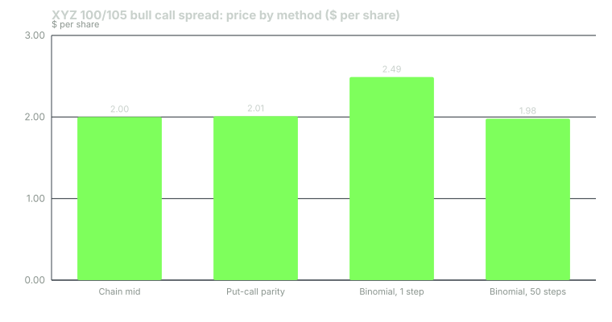

---
{
  "title": "Capstone: Price a Spread Three Ways",
  "duration": "45 min",
  "free": false,
  "status": "published",
  "quiz": [
    {"q": "In a one-step binomial tree with u = 1.1033, d = 0.9064 and one-period growth factor R = 1.00494, the risk-neutral up probability p is:", "opts": ["0.5000", "0.6000", "0.4995", "0.5005"], "correct": 3, "explain": "p = (R - d) / (u - d) = (1.00494 - 0.9064) / (1.1033 - 0.9064) = 0.09854 / 0.1969 = 0.5005."},
    {"q": "To price a call from the put side of the chain you use:", "opts": ["C = P - S + K e^(-rT)", "C = P + S - K e^(-rT)", "C = S - P", "C = K - P"], "correct": 1, "explain": "Put-call parity rearranged: C = P + S - K e^(-rT). For the XYZ 100 strike: 3.67 + 100 - 99.508 = 4.16."},
    {"q": "The one-step binomial price of the 100/105 call spread is 2.49 while the chain mid is 2.00. The main reason is:", "opts": ["A one-step tree allows only two outcomes (110.33 or 90.64) and cannot represent the stock finishing between the strikes; more steps converge toward the model price", "The chain is mispriced", "Put-call parity fails", "The multiplier was omitted"], "correct": 0, "explain": "With one step the stock lands at 110.33 (both calls ITM, spread worth 5.00) or 90.64 (worth 0). Refining the tree to 50 steps gives 1.98, within two cents of the chain."},
    {"q": "A trade plan for a debit spread must state, at minimum:", "opts": ["Entry price only", "Entry limit, profit target, loss stop, time stop, max loss and number of contracts", "The name of the strategy", "The expected profit"], "correct": 1, "explain": "The capstone rubric awards points only for a plan with every exit and the size defined before entry; a plan without a time stop or a size is incomplete."},
    {"q": "Your account is $25,000, the rule is 1% per trade, and the bear put spread's max loss with commissions is $199.30 per spread. The size is:", "opts": ["2 spreads", "3 spreads", "1 spread", "0 spreads"], "correct": 2, "explain": "250 / 199.30 = 1.25, rounded down to 1."}
  ],
  "task": "Submit your completed capstone: the three prices with every calculation shown, the trade plan, and your self-graded rubric score with a one-line justification per criterion."
}
---

## The assignment

Price one vertical spread three independent ways, reconcile the answers, and write the complete trade plan for it. Every tool you need is in Lessons 2, 8, 10 and 12. Use the course's representative XYZ chain: XYZ at $100.00 on Tuesday 22 September 2026, November 6, 2026 expiration, 45 DTE, 4% risk-free rate, no dividend, 28% implied volatility, chain mids as listed in Lesson 2. Commissions are $0.65 per contract per side. Account size for the plan is $25,000 with a 1% per-trade risk rule.

**Your spread: the 100/95 bear put spread.** Long the November 100 put, short the November 95 put.

Deliver four sections, in this order.

**Part 1: price from the chain.** Using the Lesson 2 quotes, state the mid price of each leg, the net debit at mid, the net debit at market (buy the long leg at the ask, sell the short leg at the bid), the maximum loss, the maximum gain, and the break-even at expiration. State the round-trip cost hurdle at market fills as a percent of the mid debit, commissions included.

**Part 2: price from put-call parity.** Pretend the put quotes are unavailable. Starting from the two call mids (100 call 4.16, 95 call 7.15), derive each put with P = C - S + K e^(-rT). Show K e^(-rT) for both strikes to three decimals. State the net debit implied and compare it with Part 1.

**Part 3: price from a one-step binomial tree.** Build the tree with u = e^(sigma sqrt T), d = 1/u, R = e^(rT) and p = (R - d) / (u - d). Compute the up and down stock prices, each put's payoff in each state, each put's price as the discounted risk-neutral expectation, and the net debit. Explain in two or three sentences why it differs from Parts 1 and 2 and what would bring it closer.

**Part 4: the trade plan.** Using the Lesson 9 template and the Lesson 12 checklist: thesis in one sentence with a price and a date; entry as a limit price; profit target in premium and in stock price; loss stop in premium and in stock price; time stop in DTE; the expiration-day rule; maximum loss per spread including commissions; number of spreads under the 1% rule; net delta and vega of the position per spread; the model probability of finishing below the break-even; and the one scheduled event you would check before entry.

## Worked example

To show the method without giving away your numbers, here is the same procedure applied to the **100/105 bull call spread** from Lesson 10. Your bear put spread uses identical steps with puts.

**Part 1, chain.** 100 call mid 4.16 (bid 4.08, ask 4.24); 105 call mid 2.16 (bid 2.11, ask 2.21). Debit at mid 4.16 - 2.16 = **2.00**. Debit at market: 4.24 - 2.11 = **2.13**. Max loss 2.00 (mid) or 2.13 (market). Max gain = 5.00 - 2.00 = 3.00. Break-even = 100 + 2.00 = 102.00. Round-trip cost at market: 0.13 in plus 0.13 out plus 4 x 0.65 / 100 = 0.026, total 0.286; hurdle 0.286 / 2.00 = **14.3%**.

**Part 2, parity.** K e^(-rT) with rT = 0.04 x 45/365 = 0.004932, e^(-0.004932) = 0.995081.
- 100 strike: 100 x 0.995081 = 99.508. C = P + S - K e^(-rT) = 3.67 + 100.00 - 99.508 = **4.162**.
- 105 strike: 105 x 0.995081 = 104.483. C = 6.64 + 100.00 - 104.483 = **2.157**.
- Debit = 4.162 - 2.157 = **2.005**. Agrees with the chain to half a cent; the residual is rounding of the mids.

**Part 3, one-step binomial.** T = 45/365 = 0.12329 years, sigma = 0.28.
- u = e^(0.28 x sqrt(0.12329)) = e^(0.28 x 0.35113) = e^(0.098317) = **1.1033**. d = 1 / 1.1033 = **0.9064**.
- R = e^(0.004932) = **1.00494**.
- p = (1.00494 - 0.9064) / (1.1033 - 0.9064) = 0.09854 / 0.1969 = **0.5005**; 1 - p = 0.4995.
- Up state: 100 x 1.1033 = **110.33**. Down state: 100 x 0.9064 = **90.64**.
- 100 call: up payoff 10.33, down payoff 0. Price = (0.5005 x 10.33 + 0.4995 x 0) / 1.00494 = 5.170 / 1.00494 = **5.146**.
- 105 call: up payoff 5.33, down 0. Price = 0.5005 x 5.33 / 1.00494 = **2.655**.
- Debit = 5.146 - 2.655 = **2.49**.

Why 2.49 rather than 2.00? A one-step tree lets the stock finish at only two prices, 110.33 or 90.64. In the up state both calls are ITM and the spread pays its full 5.00; in the down state it pays zero. The tree cannot represent XYZ finishing at 101 or 104, where the spread pays something between 0 and 5, and those are the most likely outcomes. It therefore mis-weights the payoff. With two steps the debit is 1.25 (now the middle node lands at exactly 100, below both strikes, and the tree under-weights); with five steps 2.33; with fifty steps **1.98**, within two cents of the chain. Binomial trees converge to the continuous model as the step count grows, and the one-step version is a way to see the replication logic, not a pricing tool.

**Part 4, plan (abbreviated).** Thesis: XYZ to 106 by 16 October. Entry: limit 2.05. Target: 3.00 (60% of max gain) or XYZ 106. Stop: 1.00 or a close below 97. Time stop: 16 October (21 DTE). Expiration rule: close before the bell on 6 November regardless. Max loss per spread: 205 + 1.30 = $206.30. Size at 1% of $25,000: 250 / 206.30 = 1.21, **1 spread**. Net delta +19, net vega +1.0 per spread. Model probability of finishing above 102.00: 42%. Event check: earnings date.

## Chart

Your bear put spread will produce the same picture from the put side: the chain and parity should agree within a cent or two, the one-step tree should overshoot by a similar margin, and you should be able to say why.

## Answer key ranges

Grade Parts 1 to 3 against these tolerances. Numbers outside the range mean an arithmetic or method error, and the rubric asks you to find it, not to adjust the answer.

- Part 1 net debit at mid: 1.98. At market (buy 100 put at 3.73, sell 95 put at 1.64): 2.09. Max gain 3.02. Break-even 98.02. Hurdle at market: (0.11 + 0.11 + 0.026) / 1.98, between 12% and 13%.
- Part 2 parity puts: 100 put within 0.01 of 3.668; 95 put within 0.01 of 1.683; debit within 0.02 of 1.985.
- Part 3 one-step tree: down-state put payoffs 9.36 (100 strike) and 4.36 (95 strike); prices within 0.01 of 4.654 and 2.169; debit within 0.02 of 2.485. Fifty-step value, if you build it in a spreadsheet, about 1.96.
- Part 4 size: max loss at a 2.05 limit is 205 + 1.30 = $206.30, one spread at 1%.

## Rubric

Score yourself out of 100. A pass is 70 with no criterion below half marks.

| Criterion | What earns full marks | Points |
|---|---|---|
| Chain pricing (Part 1) | Mid and market debits, max loss, max gain, break-even and hurdle all correct within tolerance, each with the arithmetic written out, not just the result | 20 |
| Parity pricing (Part 2) | Both discount factors to three decimals, both puts derived from calls with the formula stated, debit reconciled to Part 1 with the residual explained | 20 |
| Binomial pricing (Part 3) | u, d, R and p shown to four decimals, both state prices, both put payoffs, both discounted prices, and a correct explanation of why the one-step result differs and what convergence looks like | 25 |
| Trade plan completeness (Part 4) | All eleven required items present: thesis, entry limit, target (premium and price), stop (premium and price), time stop, expiration-day rule, max loss with commissions, size under the 1% rule rounded down, net delta and vega, break-even probability, event check | 20 |
| Internal consistency | Every number in the plan matches the pricing sections (the same debit, the same break-even, the same max loss); the size uses the max loss at the stated entry limit, not the mid; no claim of expected profit appears anywhere | 10 |
| Reconciliation note | A short paragraph stating which of the three prices you would trust to trade against and why, referencing liquidity (open interest, spread as percent of mid) rather than which method gave the highest number | 5 |

## What passing means

If you can produce this document for one spread in under an hour, you can read any Phantom Traders card, check its price against parity in your head, know what a one-step tree would say and why it is wrong, and write the exits and size before you touch the ticket. That is the whole course. The strategies you meet later, iron condors, calendars, earnings structures, are the same four positions combined; the discipline of pricing them three ways and sizing them to max loss does not change.

## Sources

- Cox, J. C., Ross, S. A. and Rubinstein, M. (1979), "Option Pricing: A Simplified Approach", *Journal of Financial Economics* 7(3): https://doi.org/10.1016/0304-405X(79)90015-1
- Black, F. and Scholes, M. (1973), "The Pricing of Options and Corporate Liabilities", *Journal of Political Economy* 81(3): https://www.jstor.org/stable/1831029
- Stoll, H. R. (1969), "The Relationship Between Put and Call Option Prices", *Journal of Finance* 24(5): https://doi.org/10.1111/j.1540-6261.1969.tb01694.x
- Options Clearing Corporation, *Characteristics and Risks of Standardized Options*: https://www.theocc.com/company-information/documents-and-archives/options-disclosure-document
