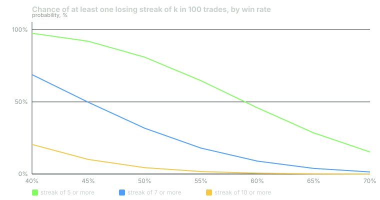

---
{
  "title": "Streaks and Variance: Why a Seven-Loss Run Is Not Information",
  "duration": "16 min",
  "free": false,
  "status": "published",
  "quiz": [
    {"q": "At a 55% win rate, the probability that any particular seven consecutive trades are all losses is:", "opts": ["0.45 x 7 = 3.15", "0.45^7 = 0.0037", "0.55^7 = 0.015", "1/7"], "correct": 1, "explain": "Independent losses multiply: 0.45 to the seventh power is 0.00374, about one in 268 for a specific starting point. But there are many starting points in a long record."},
    {"q": "Over 100 trades at a 55% win rate, the probability of at least one losing streak of seven or more is about:", "opts": ["0.4%", "3.7%", "18%", "50%"], "correct": 2, "explain": "Computed exactly by the run-length recursion in the worked example: 17.9%. Roughly one trader in six with a healthy 55% edge will see a seven-loss run in their first 100 trades."},
    {"q": "Over 1,000 trades at the same win rate, the chance of at least one seven-loss streak is about:", "opts": ["18%", "40%", "64%", "88%"], "correct": 3, "explain": "87.5%. Over a career, a seven-loss streak is close to certain for a setup that is working exactly as specified. Its arrival tells you the setup exists, not that it has stopped."},
    {"q": "Schilling (1990) showed that in n fair coin flips the longest run of heads is typically about:", "opts": ["log2(n)", "sqrt(n)", "n / 10", "2"], "correct": 0, "explain": "For 100 flips that is about 6 to 7; for 1,000 about 10. People asked to write down 'random' sequences produce runs far shorter than this, which is why real streaks feel meaningful."},
    {"q": "The process response to a losing streak inside the plan's expected range is:", "opts": ["Halve size until it ends", "Skip the next signal", "Nothing: size, setup and stop are unchanged, and the streak's length is compared with the table in the plan", "Switch to a different setup"], "correct": 2, "explain": "A streak within the range the plan predicted is a draw from the distribution, not a change in it. Only the drawdown rule (lesson 12), written in advance, can end trading, and it uses a threshold the table informed."}
  ],
  "task": "Compute the probability of at least one five-loss and one seven-loss streak in your next 100 trades at your journal's win rate, and write both numbers into your plan."
}
---

## The feeling and the arithmetic

A run of seven losses feels like a message. Lessons 5 and 6 explained why: recency makes the run the most available fact about the setup, the gambler's fallacy says the next one is due or the hot-hand belief says you are cold, and the cortisol response to a high-variance stretch makes both feel urgent. This lesson gives the arithmetic that the feeling ignores. For any setup with a real edge, long losing streaks are not merely possible; over any reasonable career they are nearly certain, and their arrival carries almost no information about whether the edge is still there.

## Runs in random sequences

Mark Schilling's 1990 paper "The Longest Run of Heads" gives the result for coins: in n fair flips, the longest run of heads is typically close to log2(n), and the distribution around that is narrow. For 100 flips, expect a run of about 6 or 7 heads somewhere; for 1,000, about 10. Schilling's classroom demonstration is the useful part. Students asked to write down a "random" sequence of 200 flips almost never include a run longer than 5, while real sequences almost always do. He could sort the real from the invented sequences by looking for the long runs. People's model of randomness has too few streaks in it, so when a real streak arrives it looks like structure.

Gilovich, Vallone and Tversky's 1985 basketball study is the same finding in a domain with a strong intuition the other way. Fans and players were sure that shooting came in streaks; the shooting records were consistent with independence. Miller and Sanjurjo (2018) later found a subtle bias in the 1985 method that had hidden a small real hot-hand effect. The corrected picture is that people perceive far more streakiness than exists, and that the streakiness that does exist is small. Nothing in the corrected literature supports sizing up because you are hot, or down because you are cold.

## The arithmetic for a trading record

Losses are independent draws in the plan's model. At a 55% win rate the loss probability is q = 0.45, and the probability that a specific block of k consecutive trades are all losses is q^k:

k = 5: 0.45^5 = 0.0185. k = 7: 0.45^7 = 0.00374. k = 10: 0.45^10 = 0.00034.

Those are small, which is where the intuition stops. But a 100-trade record has 94 places where a seven-block could start, and a career has thousands. The question that matters is "at least one streak of k somewhere in n trades", and that is computed by a short recursion: track the probability of currently being on a run of length 0, 1, ..., k - 1; each trade, a win sends everything to length 0, a loss moves each length up by one, and reaching k is absorbed into "streak happened". The figure script for this course runs that recursion; the results at q = 0.45 are:

In 100 trades: at least one streak of 5 or more, 64.7%; of 7 or more, 17.9%; of 10 or more, 1.7%.
In 250 trades: 5 or more, 93.0%; 7 or more, 40.0%; 10 or more, 4.4%.
In 500 trades: 7 or more, 64.4%. In 1,000 trades: 7 or more, 87.5%; 10 or more, 17.0%.

A seven-loss streak at a 55% win rate is an event that one healthy setup in six produces in its first 100 trades and almost all produce by 1,000. A ten-loss streak, which feels like proof of a broken system, happens to one working system in six over a career of 1,000 trades.

## Worked example

Take the plan from lesson 7, a 55% win rate, 1R stop, and work through what a seven-loss streak in the first 100 trades does and does not say.

Step 1, the specific-block probability. 0.45^7: 0.45^2 = 0.2025; 0.45^4 = 0.2025^2 = 0.0410; 0.45^6 = 0.0410 x 0.2025 = 0.00830; 0.45^7 = 0.00830 x 0.45 = 0.00374.

Step 2, the number of opportunities. In 100 trades a run of 7 can begin at trade 1 through trade 94: 94 starting points. A rough expected count of "runs of at least 7 that begin here" is 94 x 0.00374 x 0.55 (the run must be preceded by a win or the start), about 0.19. A rough probability of at least one is therefore somewhat under 0.19, because the events overlap; the exact recursion gives 0.179, or 17.9%.

Step 3, the account. Seven losses at 1R = 7R. With 1R at 1% of equity, the streak is a 7% drawdown before any wins on either side. On a $32,000 account, $2,240. This is the scale of drawdown that a working plan produces, on its own, in one record in six.

Step 4, what the streak says about the win rate. Suppose the trader has 100 trades logged, 55 wins, and the seven losses were the last seven. The win rate over 100 is still 55%, with a standard error of sqrt(0.55 x 0.45 / 100) = 0.050. If they instead compute the win rate over the last 20 trades, and those contain the seven-streak plus 8 wins in the other 13, the "recent" rate is 8 / 20 = 40% with a standard error of sqrt(0.4 x 0.6 / 20) = 0.110. The 40% is 1.4 standard errors below 55%. It is not evidence of a change; it is what the last 20 trades of a 55% setup look like about one time in ten.

Step 5, the comparison the plan should contain. What would a real change look like? If the true win rate had fallen to 45%, expectancy at 1:1 is -0.10R, and the chance of a seven-streak in 100 trades rises to 49.7%. A seven-streak is therefore about 2.8 times as likely under the broken hypothesis as under the healthy one. That is weak evidence, a likelihood ratio under 3, and it is the most a single streak can ever say. The journal's whole-log expectancy with its standard error, and the drawdown rule in lesson 12, are the instruments for the question; the streak is not one.

Step 6, the decision. Size unchanged: it is computed from prior-day equity, which has fallen 7%, so the dollar risk is 7% smaller automatically, and that is the only adjustment. Setup unchanged. Stop unchanged. The plan's streak table, written before the streak, says a seven-run was expected once in six records, and this was that record.

## Chart

## Variance is the price of the edge

The same arithmetic runs on the winning side. A six-win streak at 55% has probability 0.55^6 = 0.028 for a specific block and is close to certain somewhere in 100 trades. It feels like mastery. It carries the same information as the seven-loss streak, which is none, and the sizing rule should be equally deaf to it. A trader who sizes up on the six-win streak and down on the seven-loss streak has, over a year, taken the largest positions into the trades that followed wins and the smallest into the trades that followed losses. With independent outcomes, this adds variance and subtracts nothing from the losses; with the small real streak effects that the literature allows, it is a wash. Either way it is the doer trading, not the plan.

The plan's job is to state the variance in advance so the doer meets it as an expected event. The streak table in the plan should contain, for the plan's win rate: the probability of at least one 5-, 7- and 10-loss streak per 100 trades; the drawdown those streaks produce at the plan's size; and the sentence "a streak within this table changes nothing". The stop rule for streaks that exceed the table is lesson 12's, and its threshold is set from this table, not from how the streak feels when it arrives.

## Sources

- Mark F. Schilling, "The Longest Run of Heads", College Mathematics Journal 21(3), 1990: https://doi.org/10.2307/2686886
- Thomas Gilovich, Robert Vallone and Amos Tversky, "The Hot Hand in Basketball: On the Misperception of Random Sequences", Cognitive Psychology 17(3), 1985: https://doi.org/10.1016/0010-0285(85)90010-6
- Joshua B. Miller and Adam Sanjurjo, "Surprised by the Hot Hand Fallacy? A Truth in the Law of Small Numbers", Econometrica 86(6), 2018: https://doi.org/10.3982/ECTA14943
